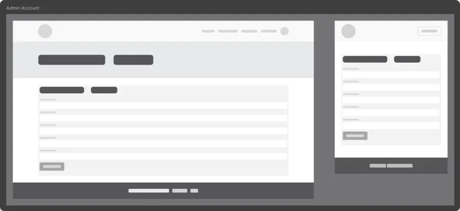
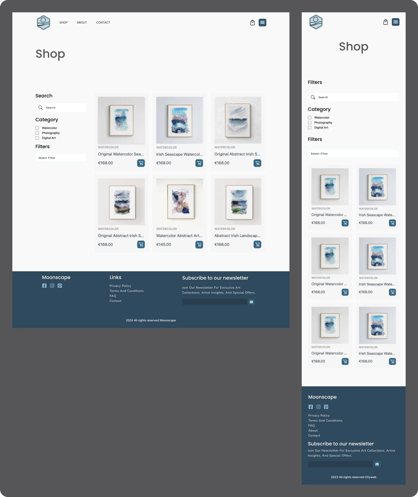
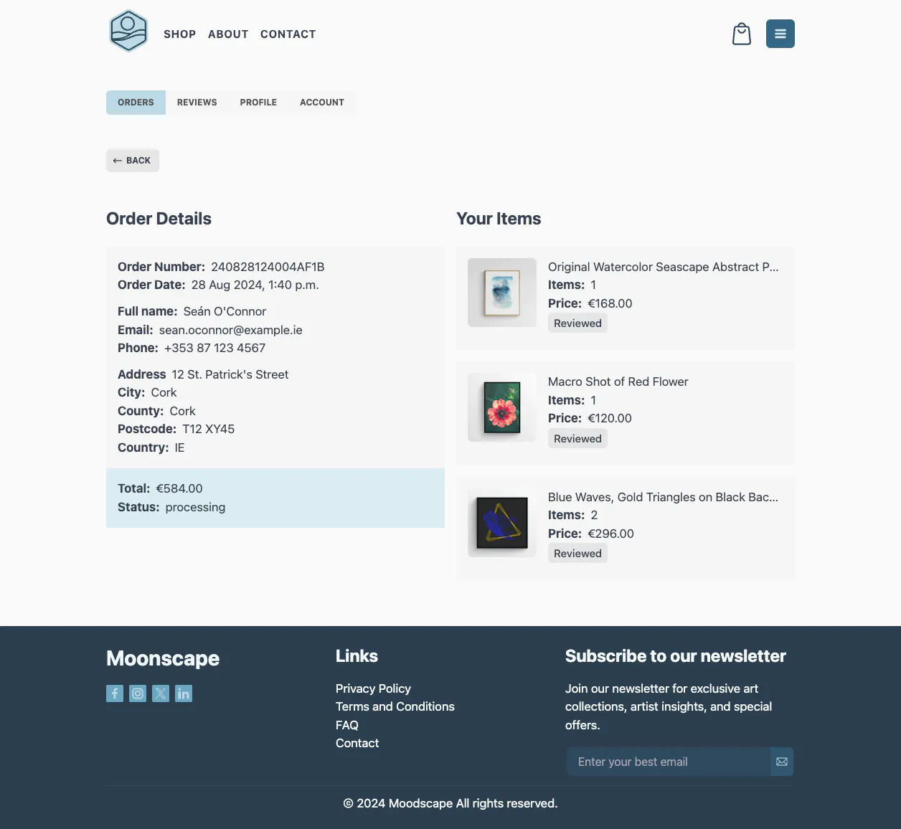

# Moodscape

Moodscape is an e-commerce platform designed to offer a curated collection of unique watercolor art, Irish abstract landscapes, floral art, macro photography, digital, and pen plotter art. This project serves as my final submission for the Full Stack Developer Diploma at Code Institute, showcasing my skills in developing a comprehensive, user-friendly online store.

The platform caters to art enthusiasts who wish to beautify their spaces with exquisite artwork. Moodscape aims to provide a seamless shopping experience, allowing users to explore and purchase art pieces easily. The website not only features a variety of art styles but also focuses on ensuring that each piece is of high quality and uniquely crafted.

   

## Project Scope and Objectives

### Project Scope

The scope of Moodscape is to develop a fully functional e-commerce platform that offers a diverse range of art forms. The project aims to showcase a variety of unique artworks and provide a seamless, user-friendly experience for art enthusiasts. The platform will support secure transactions and highlight the talents of the contributing artists.

### Website Objectives

- **Curated Collection**: Offer a wide range of carefully selected artworks, ensuring high quality and uniqueness.
- **User-Friendly Interface**: Provide an intuitive and smooth user experience for browsing and purchasing art.
- **Responsive Design**: Ensure the website is fully functional and visually appealing on all devices.
- **Secure Transactions**: Implement secure payment gateways using systems like Stripe, protecting user information and transactions.
- **Artist Promotion**: Highlight the unique qualities of the curated art collection.
- **Reviews System**: Implement a Reviews system to report successful and unsuccessful purchases to users.

### Key Components of the Website

- **Homepage**: Featuring highlighted collections, promotions, and selected artworks.
- **Product Pages**: Detailed pages for each art piece with high-quality images, descriptions, and pricing information.
- **Admin Management**: A single main user (admin) to add, edit, and manage products and content.
- **User Account Management**: Allow users to create and manage their accounts, track orders, and manage preferences.
- **Shopping Cart and Checkout**: Streamlined process for adding items to the cart and completing purchases.
- **Search and Filter Options**: Advanced search and filtering capabilities to help users find specific types of art.
- **E-commerce Functionality**: Integrate payment processing using Stripe for secure transactions.
- **Reviews System**: Inform users about the status of their purchases with clear messages.
- **Forms with Validation**: Implement forms that allow users to create and edit models in the backend with proper validation.
- **Navigation and Layout**: Incorporate a main navigation menu and structured layout for ease of use.
- **SEO Techniques**: Include meta description tags, a site title, a sitemap, and a robots.txt file to improve search engine reach.
- **Authentication and Authorization**: Implement secure login and registration pages, role-based access control, and restrict access to certain content.

By focusing on these objectives, Moodscape aims to provide a comprehensive and enjoyable online shopping experience for art lovers, while ensuring easy management and high-quality offerings from a single admin user.

## User Experience

### Audience Personas

**Persona 1: Emily - Art Enthusiast**

#### Demographics

- **Location:** Dublin, Ireland
- **Age:** 34
- **Education:** Bachelor's Degree in Art History
- **Occupation:** Marketing Manager
- **Income Level:** Upper-middle level

#### Psychographics

Emily values aesthetics and is passionate about art and interior design. She enjoys discovering new artists and unique art pieces. Emily is driven by a desire to create a beautiful and personalized home environment. She values quality and originality in the art she purchases.

#### Behavioral Traits

Emily frequently visits art galleries and art fairs. She prefers online shopping for its convenience and the broader range of options. She regularly follows artists and art influencers on social media and reads art magazines.

#### Online Habits

Emily spends a lot of time on Instagram and Pinterest for art inspiration. She visits online art marketplaces and artist websites to browse and buy art. She subscribes to newsletters from art galleries and online stores.

#### How Moodscape Meets Emily's Needs

Moodscape provides Emily with a curated collection of unique and high-quality artworks. The user-friendly interface and detailed product pages make it easy for her to find and purchase art pieces that match her taste. The platform's focus on promoting talented artists aligns with her interest in discovering new art.

**Persona 2: Michael - Gift Shopper**

#### Demographics

- **Location:** Cork, Ireland
- **Age:** 29
- **Education:** Bachelor's Degree in Computer Science
- **Occupation:** Software Developer
- **Income Level:** Mid-level, salaried

#### Psychographics

Michael values thoughtful and meaningful gifts. He enjoys finding unique items that make special presents for his friends and family. Michael appreciates high-quality craftsmanship and likes to support independent creators.

#### Behavioral Traits

Michael shops online for most of his gifts due to the convenience and variety. He tends to look for products that come with good reviews and detailed descriptions. He appreciates sites that offer gift recommendations and easy return policies.

#### Online Habits

Michael frequently visits e-commerce sites and gift recommendation blogs. He uses social media platforms like Facebook and Twitter to look for gift ideas. He reads product reviews and relies on customer Reviews before making purchases.

#### How Moodscape Meets Michael's Needs

Moodscape offers a wide range of unique and high-quality art pieces that make perfect gifts. The platform's advanced search and filter options help Michael find the right gift quickly. Detailed product descriptions and images ensure he knows exactly what he is buying, and the secure transaction process gives him peace of mind.

### User Goals

#### Emily - Art Enthusiast

- **Discover New Art:** Easily find new and unique artworks from various artists and styles.
- **Purchase High-Quality Art:** Buy high-quality, original art pieces that fit her aesthetic preferences.
- **Support Artists:** Learn about the artists and support them through her purchases.
- **Seamless Shopping Experience:** Enjoy a smooth and intuitive online shopping experience.
- **Stay Updated:** Receive updates on new collections, promotions, and featured artists.

#### Michael - Gift Shopper

- **Find Unique Gifts:** Locate unique and high-quality art pieces suitable for gifts.
- **Quick Purchase Process:** Complete purchases quickly and efficiently without hassle.
- **Detailed Product Information:** Access detailed descriptions and high-quality images of art pieces.
- **Secure Transactions:** Ensure safe and secure payment processing for peace of mind.
- **Gift Recommendations:** Get personalized gift recommendations to simplify the selection process.

### Five Planes of UX

#### 1. Strategy Plane

- **User Needs:** Understand the primary needs of our target personas, Emily and Michael. Emily seeks unique, high-quality art to enhance her home, while Michael looks for unique gifts that stand out.
- **Business Goals:** Establish Moodscape as a reputable online marketplace for unique and high-quality artworks. Promote talented artists and provide a seamless, enjoyable shopping experience for art lovers.

#### 2. Scope Plane

- **Features:**
  - Curated collection of artworks
  - Detailed product pages with high-quality images and descriptions
  - Secure online payment processing (Stripe)
  - User account management
  - Admin management for adding and updating products
  - Search and filter options
  - Reviews system for purchase status
  - Responsive design for various devices
  - SEO techniques for improved search engine reach
  - Authentication and authorization for secure access

#### 3. Structure Plane

- **Interaction Design:**
  - Users navigate through a well-structured homepage featuring collections and promotions.
  - Product pages provide comprehensive details and images.
  - The shopping cart and checkout process are streamlined and user-friendly.
  - Account management pages allow users to track orders and manage preferences.
  - The admin panel enables easy product management.
- **Information Architecture:**
  - Clear and logical categorization of artworks.
  - Intuitive navigation menu and structured layout.
  - Consistent URLs and breadcrumb navigation for ease of use.

#### 4. Skeleton Plane

- **Interface Design:**
  - Clean, modern design with a focus on high-quality images.
  - Easy-to-use navigation menu and search bar.
  - Prominent call-to-action buttons for adding items to the cart and completing purchases.
  - Responsive layout adapting to various devices and screen sizes.
- **Navigation Design:**
  - Main navigation menu with categories like Home, Shop, About, and Contact.
  - Footer with quick links to essential pages like About, Privacy Policy, Terms and Conditions and FAQ.
- **Information Design:**
  - Clear presentation of product details, prices, and availability.
  - Highlighted promotions and featured collections on the homepage.
  - Informative artist profiles with background and style descriptions.

#### 5. Surface Plane

- **Visual Design:**
  - Aesthetic and cohesive color scheme reflecting the art-focused nature of the site.
  - Use of high-quality images for artworks.
  - Professional and elegant typography for readability and style.
  - Consistent visual elements across all pages, including buttons, icons, and navigation.
  - Visual Reviews for user interactions, such as adding items to the cart or completing a purchase.

## Mockups and Wireframes

Creating mockups and wireframes was a crucial step in the design process for Moodscape. Utilizing Figma, I was able to streamline my workflow by keeping both wireframes and mockups in a single, convenient platform.

### Wireframes

I started with wireframes to provide a clear and basic structure of the website's layout and navigation. This helped in planning the overall design and functionality without getting distracted by colors or images. Each page's wireframe laid out the essential elements, such as headers, footers, navigation menus, and content sections, ensuring a user-friendly interface.

<details><summary>Home</summary>


</details>

<details><summary>About</summary>


</details>

<details><summary>Contact</summary>


</details>

<details><summary>Shop</summary>


</details>

<details><summary>Product</summary>


</details>

<details><summary>Admin Account</summary>



</details>

<details><summary>Admin Orders</summary>


</details>

<details><summary>Admin Order Update</summary>


</details>

<details><summary>Admin Products</summary>


</details>

<details><summary>Admin Product Update</summary>


</details>

### Mockups

Once the wireframes were finalized, I moved on to creating high-fidelity mockups in Figma. These mockups brought the wireframes to life by incorporating the visual elements, including the logo, brand colors, typography, and images. The mockups allowed me to visualize the final look and feel of the website, ensuring that the design aligns with our brand identity and user experience goals.

<details><summary>Home</summary>


</details>

<details><summary>About</summary>


</details>

<details><summary>Contact</summary>


</details>

<details><summary>Shop</summary>



</details>

<details><summary>Product</summary>


</details>

#### Customer Pages

<details><summary>Customer Orders</summary>


</details>

<details><summary>Customer Reviews</summary>


</details>

<details><summary>Customer Profile</summary>


</details>

<details><summary>Customer Account</summary>


</details>

#### Admin Pages

<details><summary>Admin Orders</summary>


</details>

<details><summary>Admin Customers</summary>


</details>

<details><summary>Admin Products</summary>


</details>

<details><summary>Admin Product</summary>


</details>

<details><summary>Admin Categories</summary>


</details>

## Database Design

For designing the database, I used dbdiagram.io to create an Entity-Relationship Diagram (ERD) for Moodscape. This tool allowed me to visualize the relationships between different entities, ensuring a well-structured and efficient database schema. The database is built using PostgreSQL and includes tables for users, accounts, addresses, products, images, categories, orders, order lines, payments, and reviews. Below is the ERD that illustrates the database design.


## Color Scheme

The color scheme for Moodscape has been carefully chosen to create a clean, modern, and visually appealing design. The primary colors used are white, various shades of gray, and an accent color blue that aligns with our brand identity.

#### Primary Colors

- **White:** Used as the main background color to ensure a clean and uncluttered look.
- **Grays:** Utilized for text, borders, and other UI elements to maintain a neutral and balanced appearance.

#### Accent Color

- **Brand Blue:** This accent color is used in the logo, certain buttons, and other accent elements to provide a cohesive and vibrant touch. The specific shades of blue are defined as follows in Tailwind CSS settings:

```css
'blue': {
    '50': '#f1f8fa',
    '100': '#dbecf2',
    '200': '#bcd9e5',
    '300': '#8dbed3',
    '400': '#6ca6c1',
    '500': '#3c7e9e',
    '600': '#356785',
    '700': '#30566e',
    '800': '#2e485c',
    '900': '#2a3e4f',
    '950': '#182734',
}
```

## Fonts

For this project, I have selected the Poppins font. Its clean and modern appearance enhances readability and complements the overall aesthetic of Moodscape.


## Logo Design

The logo for Moodscape is a simple yet elegant icon presenting a landscape within a hexagon shape. This design captures the essence of Moodscape brand, symbolizing the diverse and unique art forms. The logo incorporates brand color, blue, which conveys trust, tranquility, and creativity.


## Images

All images featured on the website, including product visuals, are original artworks created by my wife and me. My wife, a talented watercolor artist, has graciously permitted the use of her art pieces for the watercolor products showcased on the moodscape site. I contribute with my personal collection of macro and close-up floral photographs. Additionally, I create pen plotter art, which involves artwork generated through coding in languages like JavaScript and Python, or designed using Adobe Illustrator. This diverse array of artistic contributions enriches the visual experience of our website.

## Icons

All icons displayed on the website were personally designed by me using Adobe Illustrator, ensuring a custom and consistent look throughout. The social media icons were sourced directly from the official websites.


## Pages and Features

Website Header

The website’s header prominently displays the logo, main navigation links, a shopping bag icon, and a login icon. Upon user login, the login icon transforms into a hamburger menu button to accommodate additional user-specific options. To maintain simplicity, a customer headshot is not included; the hamburger menu alone effectively manages user navigation. On smaller screens, the main navigation links collapse into a dropdown menu, optimizing space and improving accessibility.

<details><summary>Header Desktop Visitor</summary>


</details>

<details><summary>Header Mobile Visitor</summary>


</details>

<details><summary>Header Desktop Customer</summary>


</details>

<details><summary>Header Mobile Customer</summary>


</details>

<details><summary>Header Desktop Admin</summary>


</details>

<details><summary>Header Mobile Admin</summary>


</details>

Website footer

The footer includes social media icons linking to relevant platforms, secondary website navigation links, a copyright notice, and a newsletter subscription form. The newsletter form integrates with ConvertKit, enabling efficient email list management.

<details><summary>Footer Desktop</summary>


</details>

<details><summary>Footer Mobile</summary>


</details>

When users submit their email, they receive a confirmation message asking them to verify their subscription.

<details><summary>Newsletter Success</summary>


</details>

<details><summary>Newsletter Notification</summary>


</details>

Confirmation by the user triggers an acknowledgment from ConvertKit, completing the subscription process.

<details><summary>Newsletter Confirmation</summary>


</details>

### Front End Pages

<details><summary>Home Page</summary>

The home page of the website is straightforward yet engaging, showcasing a hero section that includes a captivating headline and a call-to-action (CTA) button that directs visitors to the shop page. This section is designed to immediately grasp the attention of the visitors and guide them towards exploring the available artworks.


Below the hero section, the page features a list of art categories, allowing users to easily navigate through different types of artworks such as watercolors, photography, and pen plotter art.


Additionally, the home page highlights featured pieces, showcasing select artworks that represent the best of what the site has to offer. This layout not only enhances the visual appeal but also serves as an effective gateway to the diverse art collection on the site.


</details>

<details><summary>Shop Page</summary>

The shop page of the website is laid out with two main sections: a sidebar and a main display area for products. The sidebar enhances user interaction by providing several functional elements:

- Search Box: Allows users to quickly find products by entering keywords.
- Filters: Users can refine product listings based on price, name, and rating.
- Categories List: This feature enables users to view products from selected categories only, such as watercolors, photography, or pen plotter art.

In the main section, each product is displayed with an image, title, category, price, and an “Add to Bag” button, providing essential information and purchase options at a glance.


</details>

<details><summary>Bag Page</summary>

The bag page displays a list of products added by the user, featuring an image, title, price, and quantity for each item. Users can remove items, adjust quantities, or proceed to the checkout page directly from this page.


</details>

<details><summary>Checkout Page</summary>

The checkout page is structured into two columns: one column contains a form for users to fill in their details, shipping address, and payment information. The other column displays a summary of the products being purchased. Users also have the option to log in if they already have an account, streamlining the checkout process.


Checkout Success


</details>

<details><summary>About Page</summary>

The About Page provides a brief introduction to Moodscape. It features a straightforward layout with a descriptive paragraph and a complementary image, offering visitors a quick insight into the essence and values of Moodscape.


</details>

<details><summary>Contact Page</summary>

The Contact Page features a user-friendly contact form alongside essential contact details, including social media links.


Upon form submission, users are redirected to a success page that confirms the email has been sent.


The system ensures emails are directed to the appropriate recipient.


</details>

<details><summary>Secondary pages</summary>

Secondary pages on the website include basic informational content such as Terms and Conditions, Privacy Policy, and FAQ. These pages provide essential information regarding the site's policies and user guidance in a straightforward text format.


</details>

### Common User Pages

For user management, the website utilizes Django allauth. The authentication pages, including sign-in, sign-out, and password reset, have been customized to maintain a consistent design that aligns with the overall aesthetic of the site. This ensures a seamless user experience across all account-related interactions.

<details><summary>Sign In</summary>


</details>

<details><summary>Sign Out</summary>


</details>

<details><summary>Password Reset</summary>


</details>

### Customers Pages

<details><summary>Orders Page</summary>

The customer order page displays a table listing all orders placed by the user. Each entry in the table shows the order number, total amount, and the current status of the order. Users can click on an order to access a detailed view, providing further insights into the items purchased, payment summary, and the order's fulfillment status.


</details>

<details><summary>Order Single Page</summary>

The single order page is structured into two main columns for a detailed and user-friendly overview. The first column presents all the essential order details, such as order number, date, payment method, and shipping information. The second column lists the items purchased in that order, each with a link allowing the user to review the product directly.



</details>

<details><summary>Reviews Page</summary>

The Reviews page displays products purchased by the customer that haven't been reviewed yet. If no products are available for review, a prompt with a button to buy some art appears. Users can filter their product reviews using a dropdown menu, sorting them by status: accepted, rejected, or pending.


</details>

<details><summary>Review Single Page</summary>

The Product Review page features a straightforward form where users can submit a rating and comment about a product. Alongside the form, the product's image is displayed to remind the user of the item they are reviewing.


</details>

<details><summary>Profile Page</summary>

The profile page allows users to update their personal details and set a default address. This ensures that their information is current and streamlines the checkout process for future purchases.


</details>

<details><summary>Account Page</summary>

The account page provides a straightforward interface where users can update their email and username, allowing them to manage their login credentials easily.


</details>

### Admin Pages

<details><summary>Admin Orders</summary>

The admin orders page provides an overview of all transactions. It displays a table listing each order by number, the date it was placed, the customer's email, the current status of the order, and the total amount.


</details>

<details><summary>Admin Order Single Page</summary>

The single order page includes sections for order details, customer information, and shipment address. Admin have the ability to add, remove, or adjust the quantity of items within an order directly from this page. Additionally, admin can update the order status to canceled, completed, or processing.


</details>

<details><summary>Admin Customers Page</summary>

The customers page displays a list of all shop customers, including their names, email and created date.


</details>

<details><summary>Admin Customer Single Page</summary>

The single customer page provides options to update customer details or delete the customer profile. Deleting a customer will not remove their associated orders.


</details>

<details><summary>Admin Products Page</summary>

The Products page displays a list of all shop products, each accompanied by an image, price, category, and creation date. Admins can add new products using the 'Add Product' button.


</details>

<details><summary>Admin Product Page</summary>

The product page allows admins to update details or delete the product.


Confirmation message displayed when trying to delete a product.


</details>

<details><summary>Admin Add Product Page</summary>

The Add Product page features a form where admins can input essential details to list a new product. Mandatory fields include the product name, SKU, price, and category. The slug is generated automatically from the product name if not provided manually. Description and image are optional but can be added to enhance the product listing.


</details>

<details><summary>Admin Categories Page</summary>

The categories page displays all available categories, with an option for the admin to add new category.


</details>

<details><summary>Admin Add Category Page</summary>

The category add page features a straightforward form for adding new categories.


</details>

<details><summary>Admin Category Page</summary>

On the category page, an admin can update or delete categories. However, categories assigned to products or the default category labeled "Uncategorized" cannot be deleted. Empty categories are the only ones eligible for deletion.


Confirmation message displayed when trying to delete a category.


Error message displayed when trying to delete default category.


Error message displayed when trying to delete a category that still has products.


</details>

<details><summary>Admin Reviews Page</summary>

The review management page enables the admin to filter and display reviews based on their status: pending, approved, rejected, or deleted. The admin can modify a review's status directly from this page.


Update review page.


</details>

### CRUD Operations

#### Customer CRUD operation on the frontend

| Model | Create | Read | Update | Delete |
| --- | --- | --- | --- | --- |
| Order | :white_check_mark: | :white_check_mark: | :x: | :x: |
| Product | :x: | :white_check_mark: | :x: | :x: |
| Reviews | :x: | :white_check_mark: | :white_check_mark: | :x: |
| Customer | :x: | :white_check_mark: | :white_check_mark: | :x: |

## Technology used

### Languages and Libraries

- HTML
- CSS, SCSS
- Tailwind
- JavaScript
- Python
- Django

### Version Control and Collaboration

- Git, Git Flow, GitHub, and GitKraken - used for managing source code and collaboration
- AWS Bucket - used for storing static and media files
- VSCode - for code editing and development

### Tooling

- Gulp - used for building CSS
- Pytest - used for automated testing
- Cypress - used for end-to-end testing to ensure the entire user experience functions correctly.

### Design Tools

- Figma - used for wireframing and mockups
- Adobe Illustrator - used for designing logos and icons
- Adobe Photoshop - used to edit product images.
- DB Diagram - used for database design

### Testing and Validation

- W3C HTML Validator - For validating the HTML structure of each page.
- W3C CSS Validator - For validating the CSS.
- Web Accessibility Evaluation tool WAVE - For detecting and fixing accessibility issues.
- Google PageSpeed - For perfomance testing

### Other

- ChatGPT, Gemini - Used for content creation, and fixutes.

## Development and Deployment

### Cloning the project

1. Install Git: If you haven't already installed Git on your computer, download and install it from the Git website. Follow the installation instructions for your operating system.
2. Create project folder `mkdir moodscape`
3. Change to the project directory `cd moodscape`
4. Clone the repository `git clone https://github.com/patrickhladun/moodscape.git .`

### Environment Settings

Moodscape uses two environments: Development and Production. To keep the configuration simple and straightforward, I have split the settings into two separate files, one for each environment. This ensures that each environment's specific settings are easily manageable and distinct from one another.

#### Development

For local development, Django uses SQLite3 for simplicity and ease of setup. The development settings are optimized for debugging and rapid iteration.

#### Production

Production environment use Heroku with the Gunicorn server, PostgreSQL as the database, and AWS for storing static and media files. For sending emails, the project uses Gmail's SMTP server.

#### Environment Variables Template

Here is the template for environment variables that need to be set for server deployment:

```
ENVIRONMENT: Specifies the current environment (e.g., development, production).
SECRET_KEY: A key used for cryptographic signing, essential for Django security.
DATABASE_URL: Connection string for the database.
WEBSITE: The URL of the website for linking back or other purposes.
GMAIL_EMAIL: Email address used for sending emails from the application.
GMAIL_PASS: Password for the Gmail account used in email sending.
STRIPE_PUBLIC_KEY: Public key for Stripe API, used for handling payments.
STRIPE_SECRET_KEY: Secret key for Stripe API, used for handling payments securely.
CK_KEY: ConvertKit API key for integrating email marketing services.
CK_SECRET: ConvertKit secret key for secure access to API services.
AWS_ACCESS_KEY_ID: AWS credentials for accessing AWS services.
AWS_SECRET_ACCESS_KEY: Secret access key for secure communication with AWS services.
CY_CMS_EMAIL: Admin Email for Cypress testing.
CY_CMS_PASS: Admin Password for Cypress testing.
CY_ACCOUNT_EMAIL: Customer Email for Cypress testing.
CY_ACCOUNT_PASS: Customer Password for Cypress testing.
```

### Local Development

To run the project locally for development, follow these steps:

1. **Set Up the Database:**

   The project is set to use SQLite3 locally. Run the following command to create the database:

   ```
   python manage.py migrate
   ```

2. **Run the Project Locally:**

   Start the Django development server:

   ```
   python manage.py runserver
   ```

3. **Edit Styling and JavaScript:**

   First, install the required npm packages:

   ```
   npm install
   ```

   Make sure your Django server is running at `127.0.0.1:8000`. Then, start Gulp to enable live reloading:

   ```
   gulp
   ```

   Gulp will proxy `127.0.0.1:8000` to `localhost:3000`. This setup allows for immediate page reloads and style updates whenever source files change.

### Deployment on Heroku

To deploy Remote Forge on Heroku, follow these steps:

1. Create a Heroku Account: at [sign up here](https://signup.heroku.com/).

2. Create a New App:

   - Once logged in, click on "Create New App."
   - Enter a unique app name and select the region closest to your users.

3. Select Buildpacks:

   - Add `nodejs` and `python` as the buildpacks in the "Settings" tab.

4. Configure Environment Variables:

   - In the "Settings" tab, click on "Reveal Config Vars."
   - Input all the required environment variables

5. Connect to GitHub and Deploy:
   - In the "Deploy" tab, select "GitHub" as the deployment method.
   - Connect your GitHub account and find the desired repository.
   - Enable automatic deploys and select the main branch.
   - Click "Deploy Branch."

Your app should now be deployed and accessible on Heroku.

### Load Example Content

To start developing the site with example content, you can load predefined Users, Products, Categories, Customers and Reviews. Follow these steps to set up your database and load the example content.

#### Load Fixtures Locally

1. Ensure the database is created:<br> Run the following commands to create and set up the database:

```
python manage.py makemigrations
python manage.py migrate
```

2. Load example content:<br> Run these commands in order to load the example content:

```
python manage.py loaddata fixtures/user.superuser.json
python manage.py loaddata fixtures/user.accounts.json
python manage.py loaddata fixtures/product.categories.json
python manage.py loaddata fixtures/product.watercolors.json
python manage.py loaddata fixtures/product.plotter.json
python manage.py loaddata fixtures/product.photography.json
python manage.py loaddata fixtures/order.order.json
python manage.py loaddata fixtures/product.reviews.json
```

These commands will create the example content.

## Manual testing

All manual mobile tests are performed on a physical mobile device, ensuring that the tap interaction behaves as expected for each footer link.

### Test header links as Visitor on Desktop

| Test Performed | Expected Results | Actual Results |
| --- | --- | --- |
| On any page click on the website logo | User is redirected to the home page | As expected |
| On any page click on the Shop link | User is redirected to the shop page | As expected |
| On any page click on the About link | User is redirected to the about page | As expected |
| On any page click on the Contact link | User is redirected to the contact page | As expected |
| On any page click on the Bag Icon | User is redirected to the bag page | As expected |
| On any page click on the Sign In Button | User is redirected to the sign in page | As expected |

### Test header links as Visitor on Mobile

| Test Performed | Expected Results | Actual Results |
| --- | --- | --- |
| On any page tap on the website logo | User is redirected to the home page | As expected |
| On any page tap on the Shop link | User is redirected to the bag page | As expected |
| On any page tap menu toggle then on the Shop link | User is redirected to the shop page | As expected |
| On any page tap menu toggle then on the About link | User is redirected to the about page | As expected |
| On any page tap menu toggle then on the Contact link | User is redirected to the contact page | As expected |
| On any page tap menu toggle then on the Sign In link | User is redirected to the sign in page | As expected |

### Test header links as Customer on Desktop

| Test Performed | Expected Results | Actual Results |
| --- | --- | --- |
| On any page click on the website logo | User is redirected to the home page | As expected |
| On any page click on the Shop link | User is redirected to the shop page | As expected |
| On any page click on the About link | User is redirected to the about page | As expected |
| On any page click on the Contact link | User is redirected to the contact page | As expected |
| On any page click on the Bag Icon | User is redirected to the bag page | As expected |
| On any page click menu toggle then on the Orders link | User is redirected to the orders page | As expected |
| On any page click menu toggle then on the Reviews link | User is redirected to the reviews page | As expected |
| On any page click menu toggle then on the Profile link | User is redirected to the profile page | As expected |
| On any page click menu toggle then on the Account link | User is redirected to the account page | As expected |
| On any page click menu toggle then on the Sign Out link | User is redirected to the sign out page | As expected |

### Test header links as Customer on Mobile

| Test Performed | Expected Results | Actual Results |
| --- | --- | --- |
| On any page tap on the website logo | User is redirected to the home page | As expected |
| On any page click on the Bag Icon | User is redirected to the bag page | As expected |
| On any page tap menu toggle then on the Shop link | User is redirected to the shop page | As expected |
| On any page tap menu toggle then on the About link | User is redirected to the about page | As expected |
| On any page tap menu toggle then on the Contact link | User is redirected to the contact page | As expected |
| On any page tap menu toggle then on the Orders link | User is redirected to the orders page | As expected |
| On any page tap menu toggle then on the Reviews link | User is redirected to the reviews page | As expected |
| On any page tap menu toggle then on the Profile link | User is redirected to the profile page | As expected |
| On any page tap menu toggle then on the Account link | User is redirected to the account page | As expected |
| On any page tap menu toggle then on the Sign Out link | User is redirected to the sign out page | As expected |

### Test header links as Admin on Desktop

| Test Performed | Expected Results | Actual Results |
| --- | --- | --- |
| On any page click on the website logo | Admin is redirected to the home page | As expected |
| On any page click on the Shop link | Admin is redirected to the shop page | As expected |
| On any page click on the About link | Admin is redirected to the about page | As expected |
| On any page click on the Contact link | Admin is redirected to the contact page | As expected |
| On any page click menu toggle then on the Orders link | Admin is redirected to the orders page | As expected |
| On any page click menu toggle then on the Customers link | Admin is redirected to the customers page | As expected |
| On any page click menu toggle then on the Products link | Admin is redirected to the products page | As expected |
| On any page click menu toggle then on the Reviews link | Admin is redirected to the reviews page | As expected |
| On any page click menu toggle then on the Categories link | Admin is redirected to the categories page | As expected |
| On any page click menu toggle then on the Admin link | Admin is redirected to the django admin page | As expected |
| On any page click menu toggle then on the Sign Out link | Admin is redirected to the sign out page | As expected |

### Test header links as Admin on Mobile

| Test Performed | Expected Results | Actual Results |
| --- | --- | --- |
| On any page click on the website logo | Admin is redirected to the home page | As expected |
| On any page tap menu toggle then on the Shop link | Admin is redirected to the shop page | As expected |
| On any page tap menu toggle then on the About link | Admin is redirected to the about page | As expected |
| On any page tap menu toggle then on the Contact link | Admin is redirected to the contact page | As expected |
| On any page tap menu toggle then on the Orders link | Admin is redirected to the orders page | As expected |
| On any page tap menu toggle then on the Customers link | Admin is redirected to the customers page | As expected |
| On any page tap menu toggle then on the Products link | Admin is redirected to the products page | As expected |
| On any page tap menu toggle then on the Reviews link | Admin is redirected to the reviews page | As expected |
| On any page tap menu toggle then on the Categories link | Admin is redirected to the categories page | As expected |
| On any page tap menu toggle then on the Admin link | Admin is redirected to the django admin page | As expected |
| On any page tap menu toggle then on the Sign Out link | Admin is redirected to the sign out page | As expected |

### Test footer links on Desktop

| Test Performed | Expected Results | Actual Results |
| --- | --- | --- |
| On any page click on footer facebook icon | User is redirected to external facebook page | As expected |
| On any page click on footer instagram icon | User is redirected to external instagram page | As expected |
| On any page click on footer twitter icon | User is redirected to external twitter page | As expected |
| On any page click on footer linkedin icon | User is redirected to external linkedin page | As expected |
| On any page click on Terms and Conditions link | User is redirected to Terms and Conditions page | As expected |
| On any page click on Privacy Policy link | User is redirected to Privacy Policy page | As expected |
| On any page click on FAQ link | User is redirected to FAQ page | As expected |
| On any page click on Contact link | User is redirected to Contact page | As expected |

### Test footer links on Mobile

| Test Performed | Expected Results | Actual Results |
| --- | --- | --- |
| On any page tap on footer facebook icon | User is redirected to external facebook page | As expected |
| On any page tap on footer instagram icon | User is redirected to external instagram page | As expected |
| On any page tap on footer twitter icon | User is redirected to external twitter page | As expected |
| On any page tap on footer linkedin icon | User is redirected to external linkedin page | As expected |
| On any page tap on Terms and Conditions link | User is redirected to Terms and Conditions page | As expected |
| On any page tap on Privacy Policy link | User is redirected to Privacy Policy page | As expected |
| On any page tap on FAQ link | User is redirected to FAQ page | As expected |
| On any page tap on Contact link | User is redirected to Contact page | As expected |

### Manual tests for visitor pages

| Test Performed | Expected Results | Actual Results |
| --- | --- | --- |
| Home page - Click Browse Our Collection button | User should be redirected to the shop page | As expected |
| Home page - Click on the Watercolor Category link | User should be redirected to the shop with Watercolor products listed | As expected |
| Home page - Click on the Photography Category link | User should be redirected to the shop with Photography products listed | As expected |
| Home page - Click on the Pen Plotter Art Category link | User should be redirected to the shop with Pen Plotter products listed | As expected |
| Home page - Click on the first featured product image in the featured section | User should be redirected to the selected product page | As expected |
| Home page - Click on the second featured product image in the featured section | User should be redirected to the selected product page | As expected |
| Home page - Click on the third featured product image in the featured section | User should be redirected to the selected product page | As expected |
| Home page - Click on the fourth featured product image in the featured section | User should be redirected to the selected product page | As expected |
| Shop page - Search for "tomato" keyword | Only products that include this phrase should be displayed | As expected |
| Shop page - Click on Watercolors radio button in the Category section | Only products within the Watercolor category should be listed | As expected |
| Shop page - Click on Photography radio button in the Category section | Only products within the Photography category should be listed | As expected |
| Shop page - Click on Pen Plotter radio button in the Category section | Only products within the Pen Plotter category should be listed | As expected |
| Shop page - Click on All Items radio button in the Category section | All products should be listed | As expected |
| Shop page - Select Price: Low to High filter with all products | All products should be filtered by lowest price from top to bottom | As expected |
| Shop page - Select Price: High to Low filter with all products | All products should be filtered by highest price from top to bottom | As expected |
| Shop page - Select Rating: Low to High filter with all products | All products should be filtered by highest rating from top to bottom | As expected |
| Shop page - Select Rating: High to Low filter with all products | All products should be filtered by lowest rating from top to bottom | As expected |
| Shop page - Select Alphabetical: A to Z filter with all products | All products should be filtered from A to Z | As expected |
| Shop page - Select Alphabetical: Z to A filter with all products | All products should be filtered from Z to A | As expected |
| Shop page - Select Price: Low to High filter with Watercolors products | Only Watercolor products should be filtered by lowest price from top to bottom | As expected |
| Shop page - Select Price: High to Low filter with Watercolors products | Only Watercolor products should be filtered by highest price from top to bottom | As expected |
| Shop page - Select Rating: Low to High filter with Watercolors products | Only Watercolor products should be filtered by highest rating from top to bottom | As expected |
| Shop page - Select Rating: High to Low filter with Watercolors products | Only Watercolor products should be filtered by lowest rating from top to bottom | As expected |
| Shop page - Select Alphabetical: A to Z filter with Watercolors products | Only Watercolor products should be filtered from A to Z | As expected |
| Shop page - Select Alphabetical: Z to A filter with Watercolors products | Only Watercolor products should be filtered from Z to A | As expected |
| Shop page - Select Price: Low to High filter with Photographs products | Only Photograph products should be filtered by lowest price from top to bottom | As expected |
| Shop page - Select Price: High to Low filter with Photographs products | Only Photograph products should be filtered by highest price from top to bottom | As expected |
| Shop page - Select Rating: Low to High filter with Photographs products | Only Photograph products should be filtered by highest rating from top to bottom | As expected |
| Shop page - Select Rating: High to Low filter with Photographs products | Only Photograph products should be filtered by lowest rating from top to bottom | As expected |
| Shop page - Select Alphabetical: A to Z filter with Photographs products | Only Photograph products should be filtered from A to Z | As expected |
| Shop page - Select Alphabetical: Z to A filter with Photographs products | Only Photograph products should be filtered from Z to A | As expected |
| Shop page - Select Price: Low to High filter with Pen Plotter products | Only Pen Plotter products should be filtered by lowest price from top to bottom | As expected |
| Shop page - Select Price: High to Low filter with Pen Plotter products | Only Pen Plotter products should be filtered by highest price from top to bottom | As expected |
| Shop page - Select Rating: Low to High filter with Pen Plotter products | Only Pen Plotter products should be filtered by highest rating from top to bottom | As expected |
| Shop page - Select Rating: High to Low filter with Pen Plotter products | Only Pen Plotter products should be filtered by lowest rating from top to bottom | As expected |
| Shop page - Select Alphabetical: A to Z filter with Pen Plotter products | Only Pen Plotter products should be filtered from A to Z | As expected |
| Shop page - Select Alphabetical: Z to A filter with Pen Plotter products | Only Pen Plotter products should be filtered from Z to A | As expected |
| Shop page - Click on the product image | User should be redirected to the product page | As expected |
| Shop page - Click on the product title | User should be redirected to the product page | As expected |
| Shop page - Click on the product category on the product item | Only products within the clicked category should be listed | As expected |
| Shop page - Click on the products gray cart icon | Nothing should happen; this product is Sold Out, so the button is disabled | As expected |
| Shop page - Click on the products blue cart icon | Product should be added to the cart, and a message should show if there is stock available for the product; if not, the relevant error message should be shown | As expected |
| Product Page - Click on the "Add to Cart" button | The product should be updated, and a message should display if there is stock available for the product; otherwise, a relevant error message should be shown. | As Expected |
| Bag page - Increase product quantity and click update button | The product quantity should be updated, and a message should display if there is sufficient stock; otherwise, a relevant error message should be shown. | As Expected |
| Bag page - Decrease product quantity and click update button | The product quantity should be updated, and a message should display if there is sufficient stock; otherwise, a relevant error message should be shown. | As Expected |
| Bag page - Click on the trash button | The product should be removed from the bag. | As Expected |
| Bag page - Click on the Empty Bag button | All items should be removed from the bag. | As Expected |
| Bag page - Click on the Checkout button | The user should be redirected to the Checkout page. | As Expected |
| Checkout page - User enters incorrect email and clicks Complete Order button | A relevant error should be displayed. | As Expected |
| Checkout page - Existing customer clicks on Login link and logs in | If the customer exists, they should be logged in, redirected back to the checkout, and their saved details should be pre-filled in the checkout form. | As Expected |
| Contact page - User fills in name, correct email, and message, then clicks submit | The user should be redirected to a success page, and a confirmation email should be sent to the provided email. | As Expected |
| Contact page - User clicks on any social link in the contact details section | The user should be redirected to the corresponding social media page. | As Expected |

### Manual tests for customer pages

| Test Performed | Expected Results | Actual Results |
| --- | --- | --- |
| Orders page - Click on an order item | Customer should be redirected to the order details page. | As expected |
| Order page - Click on the "Review the Product" button for a purchased item | Customer should be redirected to the review page for the product. | As expected |
| Reviews page - Select "Approved" from the filter list | Only approved reviews should be displayed. | As expected |
| Reviews page - Select "Pending" from the filter list | Only pending reviews should be displayed. | As expected |
| Reviews page - Select "Rejected" from the filter list | Only rejected reviews should be displayed. | As expected |
| Reviews page - Select "Not Reviewed" from the filter list | Products that have not been reviewed should be displayed. | As expected |
| Reviews page - Click on the "Review" button | Customer should be redirected to the review submission page for the product. | As expected |
| Review page - Select a rating star | The selected star rating should be applied. | As expected |
| Review page - Write a review and click submit | Customer should be redirected back to the reviews page with a success message. | As expected |
| Profile page - Fill in correct details and click "Update" | Details should be updated with a success message displayed. | As expected |
| Profile page - Fill in incorrect details and click "Update" | An error message should be displayed. | As expected |
| Account page - Fill in a correct email and click "Update" | Email should be updated with a success message displayed. | As expected |
| Account page - Fill in a correct username and click "Update" | Username should be updated with a success message displayed. | As expected |
| Account page - Fill in incorrect details and click "Update" | An error message should be displayed. | As expected |

### Manual tests for admin pages

| Test Performed | Expected Results | Actual Results |
| --- | --- | --- |
| Orders page - Click on the order item | Admin should be redirected to the order details page. | As expected |
| Order page - Change order details and click "Update Order" | The form should be updated without errors. | As expected |
| Order page - Click "Delete" on an Order Item | A confirmation message should appear; if confirmed, the item should be removed. | As expected |
| Order page - Change any Order Item product or quantity and click "Update" | The order item should be updated. | As expected |
| Order page - Select a product and quantity in the blue form and click "Add Item" | An item should be added to the order. | As expected |
| Order page - Select "Complete" status and click "Update Status" | The status should be updated to "Complete" and a confirmation message should appear. | As expected |
| Order page - Select "Cancelled" status and click "Update Status" | The status should be updated to "Cancelled" and a confirmation message should appear. | As expected |
| Order page - Select "Processing" status and click "Update Status" | The status should be updated to "Processing" and a confirmation message should appear. | As expected |
| Customers page - Click on the customer item | Admin should be redirected to the customer details page. | As expected |
| Customer page - Change any Customer details and click Update | Customer deails should be updated and confirmation message should appear. | As expected |
| Customer page - Click on delete button | Confirmation message should appear, if confirmed customer should be deleted. | As expected |
| Products page - Click on the product item | Admin should be redirected to the product page. | As expected |
| Product page - Change product details and click "Update" | If there are no errors, the product should be updated, and a confirmation message should be displayed. | As expected |
| Product page - Select a new image | The new image should replace the existing one before the update is confirmed. | As expected |
| Product page - Click on the "Delete" button | A confirmation message should appear; if confirmed, the product should be deleted. | As expected |
| Add Product page - Fill in the new product details and click "Add" | If there are no errors, the product should be added, and a confirmation message should be displayed. | As expected |
| Categories page - Click on a category item | Admin should be redirected to the category details page. | As expected |
| Category page - Change category details and click "Update" | If there are no errors, the category should be updated, and a confirmation message should be displayed. | As expected |
| Category page - Click on the "Delete" button | A confirmation message should appear; if confirmed, the category should be deleted. | As expected |
| Add Category page - Fill in the new category details and click "Add" | If there are no errors, the category should be added, and a confirmation message should be displayed. | As expected |
| Reviews page - Select "Approved" from the filter list | Only approved reviews should be displayed. | As expected |
| Reviews page - Select "Pending" from the filter list | Only pending reviews should be displayed. | As expected |
| Reviews page - Select "Rejected" from the filter list | Only rejected reviews should be displayed. | As expected |
| Reviews page - Select "Deleted" from the filter list | Only deleted reviews should be displayed. | As expected |
| Review page - Select a status from the status form | The review status should update to the selected status. | As expected |

### Other manual tests

| Test Performed | Expected Results | Actual Results |
| --- | --- | --- |
| Newsletter - Submit correct email in the newsletter email field | Submitter is redirected to confirmation page and receive email confirmation from ConvertKit | As Expected |


### Responsive Design Tests

These tests are manually conducted using the Chrome browser's Toggle Device Toolbar to ensure the page elements properly adjust across various device presets.

Test Setup for Responsiveness

1. Open the home page on Chrome.
2. Activate the Toggle Device Toolbar.
3. Cycle through each device preset to check the page's responsiveness.

**What Does "Pass" Mean?** For a page to pass the responsiveness test, it must meet the following criteria:

- Text remains legible and appropriately sized for all devices.
- All interactive elements are accessible and functional.
- Content fits within the viewport without horizontal scrolling.
- The page adjusts smoothly across different screen resolutions.

| Page | Desktop/Laptops | Tablets/Smartphones |
| --- | --- | --- |
| [Home](https://moodscape-3f1dfd651cc4.herokuapp.com/) | pass | pass |
| [About](https://moodscape-3f1dfd651cc4.herokuapp.com/about/) | pass | pass |
| [Contact](https://moodscape-3f1dfd651cc4.herokuapp.com/contact/) | pass | pass |
| [Contact Success](https://moodscape-3f1dfd651cc4.herokuapp.com/contact/success/) | pass | pass |
| [Shop](https://moodscape-3f1dfd651cc4.herokuapp.com/contact/shop/) | pass | pass |
| [Product](https://moodscape-3f1dfd651cc4.herokuapp.com/product/irish-seascape-watercolor-painting/) | pass | pass |
| [Bag](https://moodscape-3f1dfd651cc4.herokuapp.com/bag/) | pass | pass |
| [Checkout](https://moodscape-3f1dfd651cc4.herokuapp.com/checkout/) | pass | pass |
| [Privacy Policy](https://moodscape-3f1dfd651cc4.herokuapp.com/privacy-policy/) | pass | pass |
| [Terms and Conditions](https://moodscape-3f1dfd651cc4.herokuapp.com/terms-and-conditions/) | pass | pass |
| [FAQ](https://moodscape-3f1dfd651cc4.herokuapp.com/faq/) | pass | pass |
| **Account Pages** |  |  |
| Orders | pass | pass |
| Order | pass | pass |
| Reviews | pass | pass |
| Review | pass | pass |
| Profile | pass | pass |
| Account | pass | pass |
| **Admin Pages** |  |  |
| Orders | pass | pass |
| Order | pass | pass |
| Customers | pass | pass |
| Customer | pass | pass |
| Products | pass | pass |
| Add Product | pass | pass |
| Update Product | pass | pass |
| Categories | pass | pass |
| Add Category | pass | pass |
| Update Category | pass | pass |
| Reviews | pass | pass |
| Review | pass | pass |

### Lighthouse Tests

I conducted Lighthouse tests on all pages, including front-end, admin, and customer areas, using Chrome's incognito mode. Each page was evaluated for: Performance, Accessibility, Best Practices, and SEO.

| Page              | Desktop         | Mobile         |
| ----------------- | --------------- | -------------- |
| Home              | 99,95,100,100   | 83,95,100,100  |
| About             | 100,100,100,100 | 89,100,100,100 |
| Contact           | 100,100,100,100 | 89,100,100,100 |
| Contact Success   | 100,98,100,66   | 87,100,100,66  |
| Shop              | 98,94,100,100   | 73,94,100,100  |
| Product           | 100,100,100,100 | 89,100,100,100 |
| Cart              | 100,98,100,100  | 89,98,100,100  |
| Checkout          | 98,95,100,100   | 89,98,100,100  |
|                   |                 |                |
| **Account Pages** |                 |                |
|                   |                 |                |
| Orders            | 100,100,100,100 | 89,98,100,100  |
| Order             | 100,100,100,100 | 87,100,100,100 |
| Reviews           | 100,96,100,100  | 91,94,100,100  |
| Review            | 100,100,96,100  | 89,98,100,100  |
| Profile           | 100,100,100,100 | 87,98,100,100  |
| Account           | 100,100,100,100 | 89,98,100,100  |
|                   |                 |                |
| **Admin Pages**   |                 |                |
|                   |                 |                |
| Orders            | 99,100,100,100  | 87,98,100,100  |
| Order             | 100,95,100,100  | 85,93,100,100  |
| Customers         | 99,100,100,100  | 87,98,100,100  |
| Customer          | 100,100,100,100 | 87,98,100,100  |
| Products          | 98,100,100,100  | 75,98,100,100  |
| Product           | 97,96,81,100    | 75,98,100,100  |
| Add Products      | 97,96,81,100    | 71,96,82,100   |
| Categories        | 100,100,100,100 | 87,98,100,100  |
| Category          | 99,100,100,100  | 85,100,100,100 |
| Add Category      | 100,100,100,100 | 87,100,100,100 |
| Reviews           | 100,96,100,100  | 87,97,100,100  |
| Review            | 99,96,100,100   | 88,94,100,100  |

### HTML Validation and Accessibility Testing

This section details the manual tests for HTML validation and accessibility. Tests were performed using the W3C Validator and the WAVE tool by WebAIM. Publicly accessible pages were tested using direct URLs, while secure pages (such as account and admin sections) were tested by inputting the source code directly into the validator due to access restrictions.

| Tested Page | Accessibility (WAVE) | Contrast (WAVE) | W3C HTML Validation | Comments |
| --- | --- | --- | --- | --- |
| [Home](https://moodscape-3f1dfd651cc4.herokuapp.com/) | No Errors | No Contrast Errors | [No Errors](https://validator.w3.org/nu/?doc=https%3A%2F%2Fmoodscape-3f1dfd651cc4.herokuapp.com%2F) |  |
| [About](https://moodscape-3f1dfd651cc4.herokuapp.com/about/) | No Errors | No Contrast Errors | [No Errors](https://validator.w3.org/nu/?doc=https%3A%2F%2Fmoodscape-3f1dfd651cc4.herokuapp.com%2Fabout%2F) |  |
| [Contact](https://moodscape-3f1dfd651cc4.herokuapp.com/contact/) | No Errors | No Contrast Errors | [No Errors](https://validator.w3.org/nu/?doc=https%3A%2F%2Fmoodscape-3f1dfd651cc4.herokuapp.com%2Fcontact%2F) |  |
| [Contact Success](https://moodscape-3f1dfd651cc4.herokuapp.com/contact/success/) | No Errors | No Contrast Errors | [No Errors](https://validator.w3.org/nu/?doc=https%3A%2F%2Fmoodscape-3f1dfd651cc4.herokuapp.com%2Fcontact%2Fsuccess%2F) |  |
| [Shop](https://moodscape-3f1dfd651cc4.herokuapp.com/shop/) | No Errors | No Contrast Errors | [With Errors](https://moodscape-3f1dfd651cc4.herokuapp.com/shop/) | Error only appears on the live website. Not reproducible in development. Issue has been logged. |
| [Product](https://moodscape-3f1dfd651cc4.herokuapp.com/product/irish-seascape-watercolor-painting/) | No Errors | No Contrast Errors | [No Errors](https://validator.w3.org/nu/?doc=https%3A%2F%2Fmoodscape-3f1dfd651cc4.herokuapp.com%2Fproduct%2Firish-seascape-watercolor-painting%2F) |  |
| [Bag](https://moodscape-3f1dfd651cc4.herokuapp.com/bag/) | No Errors | No Contrast Errors | [No Errors](https://validator.w3.org/nu/?doc=https%3A%2F%2Fmoodscape-3f1dfd651cc4.herokuapp.com%2Fbag%2F) | Errors observed when products are added to the bag. An issue has been created. |
| [Checkout](https://moodscape-3f1dfd651cc4.herokuapp.com/checkout/) | No Errors | No Contrast Errors | [No Errors](https://validator.w3.org/nu/?doc=https%3A%2F%2Fmoodscape-3f1dfd651cc4.herokuapp.com%2Fcheckout%2F) |  |
| [Privacy Policy](https://moodscape-3f1dfd651cc4.herokuapp.com/privacy-policy/) | No Errors | No Contrast Errors | [No Errors](https://validator.w3.org/nu/?doc=https%3A%2F%2Fmoodscape-3f1dfd651cc4.herokuapp.com%2Fprivacy-policy%2F) |  |
| [Terms and Conditions](https://moodscape-3f1dfd651cc4.herokuapp.com/terms-and-conditions/) | No Errors | No Contrast Errors | [No Errors](https://validator.w3.org/nu/?doc=https%3A%2F%2Fmoodscape-3f1dfd651cc4.herokuapp.com%2Fterms-and-conditions%2F) |  |
| [FAQ](https://moodscape-3f1dfd651cc4.herokuapp.com/faq/) | No Errors | No Contrast Errors | [No Errors](https://validator.w3.org/nu/?doc=https%3A%2F%2Fmoodscape-3f1dfd651cc4.herokuapp.com%2Ffaq%2F) |  |
| [Newsletter Success](https://moodscape-3f1dfd651cc4.herokuapp.com/newsletter/success/) | No Errors | No Contrast Errors | [No Errors](https://validator.w3.org/nu/?doc=https%3A%2F%2Fmoodscape-3f1dfd651cc4.herokuapp.com%2Fnewsletter%2Fsuccess%2F) |  |
|  |  |  |  |  |
| **Account Pages** |  |  |  |  |
|  |  |  |  |  |
| Account - Orders | No Errors | No Contrast Errors | No Errors |  |
| Account - Order | No Errors | No Contrast Errors | No Errors |  |
| Account - Reviews | No Errors | No Contrast Errors | No Errors |  |
| Account - Review | No Errors | No Contrast Errors | No Errors |  |
| Account - Profile | No Errors | No Contrast Errors | No Errors |  |
| Account - Account | No Errors | No Contrast Errors | No Errors |  |
|  |  |  |  |  |
| **Admin Pages** |  |  |  |  |
|  |  |  |  |  |
| Admin - Orders | No Errors | No Contrast Errors | No Errors |  |
| Admin - Order | No Errors | No Contrast Errors | No Errors |  |
| Admin - Customers | No Errors | No Contrast Errors | No Errors |  |
| Admin - Customer | No Errors | No Contrast Errors | No Errors |  |
| Admin - Products | No Errors | No Contrast Errors | No Errors |  |
| Admin - Add Product | No Errors | No Contrast Errors | No Errors |  |
| Admin - Update Product | No Errors | No Contrast Errors | No Errors |  |
| Admin - Categories | No Errors | No Contrast Errors | No Errors |  |
| Admin - Add Category | No Errors | No Contrast Errors | No Errors |  |
| Admin - Update Category | No Errors | No Contrast Errors | No Errors |  |
| Admin - Reviews | No Errors | No Contrast Errors | No Errors |  |
| Admin - Review | No Errors | No Contrast Errors | No Errors |  |

### CSS Validation

The CSS for my project was validated using the W3C CSS Validation Service online tool. The validation process identified some errors and warnings, predominantly stemming from the Flowbite framework. Most issues relate to vendor extensions, including vendor-specific pseudo-classes and pseudo-elements. These vendor extensions are commonly used in modern web development to ensure compatibility and functionality across various browsers, despite triggering validation warnings.

[W3C CSS Validator results](https://jigsaw.w3.org/css-validator/validator?uri=https%3A%2F%2Fmoodscape-3f1dfd651cc4.herokuapp.com%2F&profile=css3svg&usermedium=all&warning=1&vextwarning=&lang=en#errors)

### JavaScript Validation

## Automated testing with Pytest and Cypress

### Pytest Tests

I chose Pytest for testing the application due to its straightforward syntax and ease of use. Pytest supports advanced features like parameterization, fixtures, and plugins, which enhance the testing process by allowing for more flexible and powerful test scenarios. It's also free and has strong community support.
Throughout the development process, I used a combination of test-driven development (TDD) and writing tests after coding the features. This method helped make sure that most parts of the application were well-tested, making it more reliable and easier to maintain.

**List of Tests with Descriptions:**

- **bag app `test_no_empty_path`** - Verifies no URL configurations have empty paths.
- **common app `test_icon`** - Checks correct SVG HTML output for predefined icons and sizes.
- **common app `test_icon_with_size`** - Confirms correct application of size-specific classes to icons.
- **common app `test_icon_with_class_name`** - Confirms custom classes are added correctly to icons.
- **common app `test_icon_not_found`** - Ensures proper handling of non-existent icons with appropriate error messaging.
- **common app `test_active_exact_match`** - Validates the `active` template tag by ensuring it correctly returns 'active' for matching URL paths and an empty string for non-matching paths.
- **common app `test_addstr_filter`** - Tests the `addstr` template filter to ensure it concatenates various types of inputs correctly, producing the expected string results.
- **frontend app `test_views_status`** - Checks that each page in the frontend application returns a status code of 200 (OK) and renders the correct template associated with each URL.
- **frontend app `test_contact_form_initial_state`** - Verifies that the contact form is unbound when initially loaded, ensuring that the form does not hold any data on a fresh request.
- **frontend app `test_contact_post_valid`** - Tests that a valid POST request to the contact form results in a redirection to the success page, sends an email confirmation, and verifies the email content.
- **frontend app `test_contact_post_invalid`** - Ensures that submitting an invalid form (missing required fields) on the contact page returns a status code of 200 and retains the form errors in the response context.
- **frontend app `test_shop_view_list_all_products`** - Confirms that the shop view successfully lists all products and their details match expected values, ensuring product data is correctly passed to the template.
- **frontend app `test_urls_resolves`** - Confirms that URLs in the frontend application are correctly resolved to their corresponding view functions.
- **frontend app `test_contact_form_initial_state`** - Checks that a newly initialized `ContactForm` is not bound to any data.
- **frontend app `test_contact_form_with_valid_data`** - Ensures the `ContactForm` validates correctly when provided with valid data. It checks that the form is bound, validates successfully, and correctly handles and returns cleaned data.
- **frontend app `test_contact_form_with_empty_data`** - Tests that the `ContactForm` correctly identifies and handles required fields when submitted with empty data. It verifies that the form is bound, validation fails, and appropriate error messages are generated for missing required fields.
- **frontend app `test_contact_form_with_invalid_email`** - Verifies that the `ContactForm` properly validates the email field and returns an error for invalid email addresses, ensuring accurate data validation.
- **order app `test_cms_order_update_view_update_status`** - Verifies that an order's status is successfully updated when appropriate form data is posted to the CMS order update view.
- **order app `test_cms_order_update_view_update_form`** - Confirms that an order can be successfully updated with new customer and address details via the CMS order update view.
- **order app `test_cms_order_update_view_add_item`** - Checks that an item can be successfully added to an order through the CMS order update view.
- **order app `test_cms_order_update_view_update_item`** - Ensures that an existing item in an order can be updated for both product and quantity through the CMS order update view.
- **order app `test_cms_order_update_view_delete_item`** - Tests that an item can be successfully removed from an order using the CMS order update view.
- **order app `test_cms_orders_view`** - Ensures that the CMS orders view correctly displays all orders and operates with the expected template.
- **order app `test_no_empty_path`** - Verifies that there are no empty URL paths in the URL configurations of the `order` application, ensuring that each URL path is correctly specified.
- **order app `test_cms_orders_url_resolves`** - Confirms that the URL for the CMS orders page correctly resolves to the appropriate view function.
- **order app `test_cms_order_update_url_resolves`** - Ensures that the URL for updating an order in the CMS correctly resolves to the appropriate view function and accepts an order number as a parameter.
- **order app `test_create_order_form_has_correct_fields`** - Checks that the CreateOrderForm contains all the expected fields with the correct field types.
- **order app `test_create_order_form_has_correct_placeholders`** - Verifies that the placeholders for the CreateOrderForm fields are correctly set and marked for required fields.
- **order app `test_create_order_form_first_name_autofocus`** - Ensures that the 'first_name' field in the CreateOrderForm is set to autofocus on form rendering.
- **order app `test_create_order_form_invalid_fields`** - Tests various validation errors for fields in the CreateOrderForm using predefined invalid data to ensure robust data validation.
- **order app `test_update_order_form_has_correct_fields`** - Confirms that the UpdateOrderForm contains all expected fields with the correct field types.
- **order app `test_update_order_form_invalid_fields`** - Checks for various validation errors using invalid data to ensure the UpdateOrderForm correctly handles field validation.
- **order app `test_add_order_item_form_has_correct_fields`** - Verifies that the AddOrderItemForm includes the correct fields ('product' and 'quantity') and that these fields use the appropriate Django field types.
- **order app `test_add_order_item_form_valid_data`** - Tests that the AddOrderItemForm processes and validates correct data successfully, adding an order item with valid product and quantity.
- **order app `test_add_order_item_form_invalid_data`** - Ensures that the AddOrderItemForm handles invalid data correctly and does not validate negative quantities.
- **order app `test_update_order_status_form_has_correct_fields`** - Confirms that the UpdateOrderStatusForm has the correct fields with appropriate choices for 'status'.
- **order app `test_update_order_status_form_valid_data`** - Tests that the UpdateOrderStatusForm validates correctly when given a valid status choice, ensuring proper form processing.
- **order app `test_update_order_status_form_invalid_data`** - Ensures that the UpdateOrderStatusForm correctly identifies invalid status choices and provides appropriate error messages.
- **product app `test_product_view`** - Verifies that the product view correctly displays the product page and loads the correct product details based on the product's slug.
- **product app `test_add_product_as_superadmin`** - Checks that a superadmin can successfully add a new product through the CMS product add form and ensures the product is saved in the database with correct details.
- **product app `test_add_product_with_invalid_data`** - Validates form error handling in the CMS product add form by submitting various forms of invalid data and expecting appropriate error messages.
- **product app `test_category_view`** - Ensures the category view for a superadmin correctly displays the list of categories.
- **product app `test_add_category_as_superadmin`** - Tests that a superadmin can add a new category through the CMS and checks that the category is correctly added to the database.
- **product app `test_add_category_with_invalid_data`** - Tests error handling in the category add form by submitting invalid data and expecting appropriate error responses.
- **product app `test_no_empty_path`** - Ensures there are no empty paths in the product app's URL configuration, which could potentially lead to routing errors.
- **product app `test_product_url_resolves`** - Confirms that the URL for a product detail page resolves correctly to the intended view function with the correct slug parameter.
- **product app `test_category_meta_options`** - Checks that the meta options for the Category model are correctly set.
- **product app `test_category_creation`** - Verifies that a new category can be created with correct attributes and that it is stored properly in the database.
- **product app `test_category_slug_unique`** - Ensures that category slugs are unique and raises a validation error if a duplicate slug is entered.
- **product app `test_product_meta_options`** - Confirms the meta options for the Product model are set correctly.
- **product app `test_product_creation`** - Tests creating a new product with correct attributes and checks that it reflects correctly in the database.
- **product app `test_product_fields`** - Validates various field types within the Product model to ensure they conform to expected types and behaviors.
- **product app `test_product_sku_unique`** - Ensures that product SKUs are unique and a validation error is raised for duplicate SKUs.
- **product app `test_product_form_initial_state`** - Confirms the initial state of the ProductForm to verify it is not bound and ready for input.
- **product app `test_product_form_with_valid_data`** - Tests the ProductForm with valid input data to ensure it is correctly bound, validated, and all fields are correctly populated.
- **product app `test_product_form_with_empty_data`** - Validates that the ProductForm correctly handles empty data submissions and returns appropriate error messages.
- **product app `test_product_form_slug_generation`** - Tests the automatic slug generation of the ProductForm to ensure it creates appropriate, URL-friendly slugs based on product name input.
- **product app `test_product_stock_validation`** - Tests validation for the 'stock' field in the ProductForm to ensure negative stock values are handled correctly with an error.
- **product app `test_product_form_details_field_type`** - Verifies that the 'details' field in the ProductForm uses the expected widget type, ensuring correct UI elements are used for input.
- **review app `test_cms_reviews_view_unauthenticated`** - Checks if unauthenticated users are redirected when trying to access the CMS reviews page.
- **review app `test_cms_reviews_view_customer`** - Ensures customers are redirected from accessing the CMS reviews page, which is intended only for admins.
- **review app `test_cms_reviews_view_superuser`** - Verifies that a superuser can access the CMS reviews page and that the correct template is used with the expected number of reviews loaded.
- **review app `test_cms_reviews_view_filter_status`** - Tests the filtering functionality on the CMS reviews page by status, ensuring the correct count of reviews is displayed based on the filter applied.
- **review app `test_cms_review_update_view_unauthenticated`** - Ensures that unauthenticated users are redirected when attempting to update a review.
- **review app `test_cms_review_update_view_customer`** - Confirms that customers cannot access the review update page, which is restricted to admins.
- **review app `test_cms_review_update_superuser`** - Tests that a superuser can update a review's status and that the update is reflected in the database.
- **review app `test_account_reviews_view_unauthenticated`** - Checks if unauthenticated users are redirected when trying to access their account reviews page.
- **review app `test_account_reviews_view_authenticated_with_reviews`** - Verifies that authenticated users with reviews can view their reviews on the account page.
- **review app `test_account_review_submit_view_post`** - Ensures that authenticated users can submit a review through the account review submission page and that the submission is reflected in the database.
- **review app `test_no_empty_path`** - Verifies that there are no empty paths in the review app's URL patterns, ensuring all URLs are correctly configured.
- **review app `test_cms_reviews_url`** - Confirms that the URL for the CMS reviews page resolves to the correct view function.
- **review app `test_cms_review_update_url`** - Ensures the URL for updating a review resolves to the correct view function and accepts an ID parameter.
- **review app `test_account_reviews_url`** - Checks that the URL for the account reviews page resolves to the correct view function.
- **review app `test_account_review_submit_url`** - Verifies that the URL for submitting a review resolves to the correct view function and accepts an ID parameter.
- **review app `test_review_form_initialization`** - Checks that the ReviewForm is initialized correctly with the expected fields.
- **review app `test_review_form_valid_data`** - Ensures the ReviewForm validates correctly when provided with valid data.
- **review app `test_review_form_invalid_data`** - Tests that the ReviewForm correctly identifies and handles invalid data.
- **review app `test_review_form_rendering`** - Verifies that the ReviewForm renders correctly in HTML.
- **review app `test_review_status_form_initialization`** - Confirms that the ReviewStatusForm is initialized correctly with the expected status field.
- **review app `test_review_status_form_valid_data`** - Checks that the ReviewStatusForm validates correctly when provided with a valid status.
- **review app `test_review_status_form_invalid_data`** - Ensures the ReviewStatusForm correctly identifies and handles invalid status choices.
- **user app `test_view_status_for_unauthenticated_user`** - Checks if unauthenticated users are redirected when attempting to access user account-related pages.
- **user app `test_view_status_for_authenticated_account_user`** - Verifies that authenticated users can access their account page with the correct template loaded.
- **user app `test_account_view_form`** - Ensures that the account page loads the AccountProfileForm with the correct user instance when visited by an authenticated user.
- **user app `test_update_account_user_email_form`** - Tests the functionality to update the user's email through the AccountProfileForm on the account page.
- **user app `test_urls_resolve`** - Ensures that user account-related URLs resolve to the correct views as expected.
- **user app `test_account_form_initial_state`** - Checks that the AccountProfileForm is not bound when initially created.
- **user app `test_account_form_update_email`** - Verifies that the email can be updated correctly through the AccountProfileForm for a superuser.
- **user app `test_account_form_update_username`** - Confirms that the username can be updated correctly through the AccountProfileForm for a superuser.
- **user app `test_account_form_missing_email`** - Tests that the AccountProfileForm validation fails when the email field is empty.
- **user app `test_account_form_invalid_email`** - Checks for an error when an invalid email is submitted through the AccountProfileForm.
- **user app `test_account_form_missing_username`** - Ensures that the AccountProfileForm validation fails when the username field is empty.
- **user app `test_user_admin_registration`** - Confirms that the User model is registered with the UserAdmin class.
- **user app `test_user_admin_list_display`** - Verifies that the correct fields are displayed in the user admin list.
- **user app `test_user_admin_search_fields`** - Ensures that the admin search functionality is set up for the User model.
- **user app `test_user_admin_ordering`** - Confirms that users are ordered by email in the admin panel.
- **user app `test_user_admin_fieldsets`** - Checks that the UserAdmin fieldsets are configured correctly.
- **user app `test_user_admin_add_fieldsets`** - Verifies that the add_fieldsets for creating a new user in admin are set up correctly.
- **user app `test_user_admin_readonly_fields`** - Ensures that the last_login and date_joined fields are read-only in the admin panel.

**Tests Recording**


**Tests Coverage**

| Name                                  | Stmts | Miss | Cover |
| ------------------------------------- | ----- | ---- | ----- |
| apps/bag/apps.py                      | 4     | 0    | 100%  |
| apps/bag/context.py                   | 22    | 6    | 73%   |
| apps/bag/templatetags/bag_tools.py    | 5     | 1    | 80%   |
| apps/bag/urls.py                      | 3     | 0    | 100%  |
| apps/bag/views.py                     | 53    | 45   | 15%   |
| apps/checkout/apps.py                 | 4     | 0    | 100%  |
| apps/checkout/urls.py                 | 4     | 0    | 100%  |
| apps/checkout/views.py                | 80    | 66   | 18%   |
| apps/common/apps.py                   | 4     | 0    | 100%  |
| apps/common/decorators.py             | 6     | 0    | 100%  |
| apps/common/sitemaps.py               | 17    | 5    | 71%   |
| apps/common/templatetags/text_tags.py | 8     | 0    | 100%  |
| apps/common/templatetags/ui_tags.py   | 74    | 16   | 78%   |
| apps/common/urls.py                   | 6     | 0    | 100%  |
| apps/common/utils/metadata.py         | 95    | 7    | 93%   |
| apps/common/views.py                  | 4     | 2    | 50%   |
| apps/frontend/apps.py                 | 4     | 0    | 100%  |
| apps/frontend/context_processors.py   | 3     | 0    | 100%  |
| apps/frontend/forms.py                | 7     | 0    | 100%  |
| apps/frontend/models.py               | 1     | 0    | 100%  |
| apps/frontend/urls.py                 | 4     | 0    | 100%  |
| apps/frontend/views.py                | 119   | 44   | 63%   |
| apps/order/admin.py                   | 12    | 0    | 100%  |
| apps/order/apps.py                    | 4     | 0    | 100%  |
| apps/order/forms.py                   | 48    | 2    | 96%   |
| apps/order/models.py                  | 75    | 4    | 95%   |
| apps/order/urls.py                    | 4     | 0    | 100%  |
| apps/order/views.py                   | 84    | 20   | 76%   |
| apps/product/admin.py                 | 30    | 0    | 100%  |
| apps/product/apps.py                  | 6     | 0    | 100%  |
| apps/product/forms.py                 | 32    | 1    | 97%   |
| apps/product/models.py                | 47    | 0    | 100%  |
| apps/product/signals.py               | 17    | 2    | 88%   |
| apps/product/urls.py                  | 3     | 0    | 100%  |
| apps/product/views.py                 | 130   | 58   | 55%   |
| apps/review/admin.py                  | 8     | 0    | 100%  |
| apps/review/apps.py                   | 4     | 0    | 100%  |
| apps/review/forms.py                  | 11    | 0    | 100%  |
| apps/review/models.py                 | 25    | 1    | 96%   |
| apps/review/urls.py                   | 3     | 0    | 100%  |
| apps/review/views.py                  | 117   | 52   | 56%   |
| apps/user/admin.py                    | 12    | 0    | 100%  |
| apps/user/apps.py                     | 4     | 0    | 100%  |
| apps/user/forms.py                    | 10    | 0    | 100%  |
| apps/user/models.py                   | 71    | 24   | 66%   |
| apps/user/urls.py                     | 3     | 0    | 100%  |
| apps/user/views.py                    | 68    | 36   | 47%   |
| config/settings/common.py             | 54    | 0    | 100%  |
| config/settings/development.py        | 7     | 0    | 100%  |
| config/urls.py                        | 16    | 2    | 88%   |
| **TOTAL**                             | 1432  | 394  | 72%   |

#### How to run Pytest tests

1. **Ensure pytest is Installed:**

Make sure `pytest` is installed in your project environment. If it's not installed, you can install it using pip:

```sh
pip install pytest
```

2. **Run the tests**

```sh
pytest
```
3. **Run the tests with more details**

```sh
pytest -s -rP -vv
```

### Cypress tests

| Spec | Duration | Tests | Passing | Failing | Pending | Skipped |
| --- | --- | --- | --- | --- | --- | --- |
| `footer_spec.js` | 626ms | 5 | 5 | 0 | 0 | 0 |
| `header_spec.js` | 00:02 | 10 | 10 | 0 | 0 | 0 |
| `account/account_navigation_spec.js` | 00:02 | 2 | 2 | 0 | 0 | 0 |
| `account/account_page_account_spec.js` | 00:03 | 3 | 3 | 0 | 0 | 0 |
| `account/account_page_orders_spec.js` | 00:01 | 1 | 1 | 0 | 0 | 0 |
| `account/account_page_profile_spec.js` | 00:07 | 9 | 9 | 0 | 0 | 0 |
| `account/account_page_reviews_spec.js` | 00:01 | 5 | 5 | 0 | 0 | 0 |
| `account/account_title_section_spec.js` | 00:01 | 4 | 4 | 0 | 0 | 0 |
| `allauth/allauth_spec.js` | 274ms | 4 | 4 | 0 | 0 | 0 |
| `visitors/about_spec.js` | 308ms | 2 | 2 | 0 | 0 | 0 |
| `visitors/bag_spec.js` | 00:01 | 5 | 5 | 0 | 0 | 0 |
| `visitors/checkout_page.js` | 00:05 | 3 | 3 | 0 | 0 | 0 |
| `visitors/contact_spec.js` | 00:06 | 9 | 9 | 0 | 0 | 0 |
| `visitors/faq_spec.js` | 378ms | 2 | 2 | 0 | 0 | 0 |
| `visitors/home_spec.js` | 00:06 | 26 | 26 | 0 | 0 | 0 |
| `visitors/privacy_spec.js` | 890ms | 2 | 2 | 0 | 0 | 0 |
| `visitors/terms_spec.js` | 351ms | 2 | 2 | 0 | 0 | 0 |
| **Total All Specs** | **00:42** | **94** | **94** | **0** | **0** | **0** |

### Running Cypress Tests

To open Cypress in interactive mode:

```sh
npm run cy:open
```

To run Cypress tests headlessly:

```sh
npm run cy:run
```

## Issues

### User Stories

### Bugs

- [#77 Inconsistent Confirmation Dialogs in Admin Panel](https://github.com/patrickhladun/moodscape/issues/77)
- [#78 Duplicated quantity ID](https://github.com/patrickhladun/moodscape/issues/78)
- [#79 Unclosed HTML elements on Shop Page](https://github.com/patrickhladun/moodscape/issues/79)

## Further Improvements

## Credits

### Articles and Videos:

## Acknowledgments
