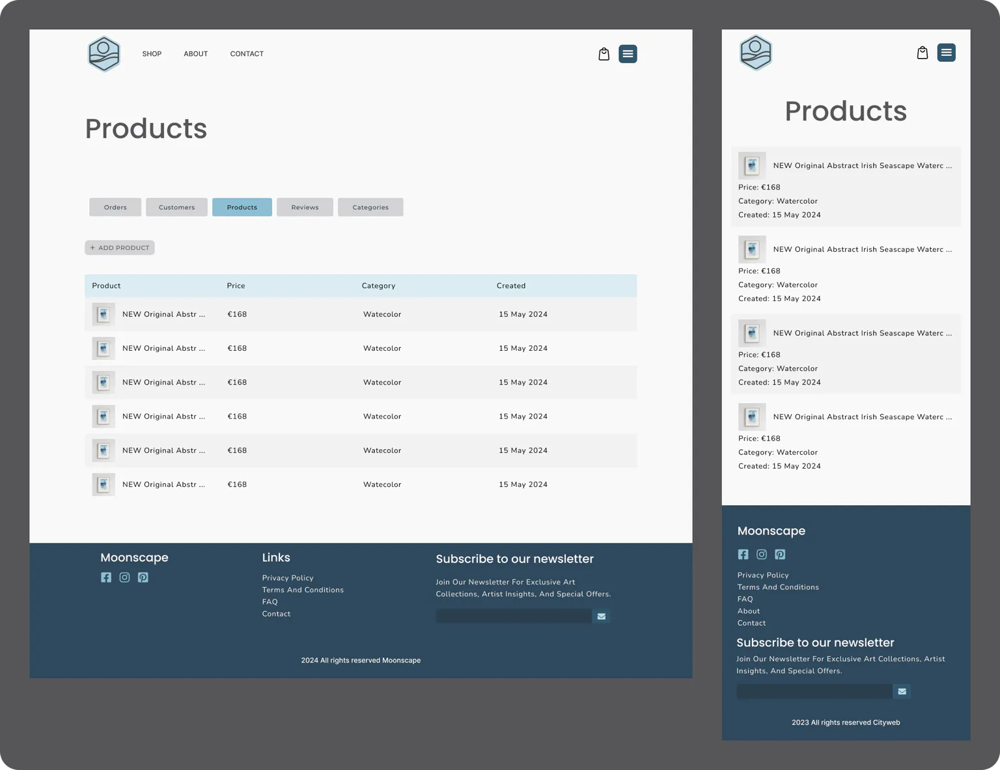
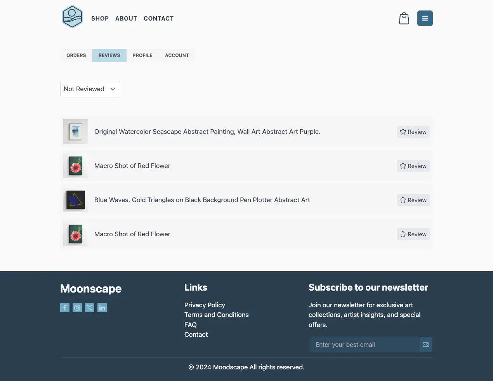
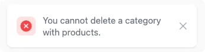

# Moodscape

Moodscape is an e-commerce platform designed to offer a curated collection of unique watercolor art, Irish abstract landscapes, floral art, macro photography, digital art, and pen plotter art. This project serves as my final submission for the Full Stack Developer Diploma at Code Institute, showcasing my skills in developing a comprehensive, user-friendly online store.

The platform caters to art enthusiasts who wish to beautify their spaces with exquisite artwork. Moodscape aims to provide a seamless shopping experience, allowing users to explore and purchase art pieces easily. The website not only features a variety of art styles but also focuses on ensuring that each piece is of high quality and uniquely crafted.

   

## Project Scope and Objectives

### Project Scope

The scope of Moodscape is to develop a fully functional e-commerce platform that offers a diverse range of art forms. The project aims to showcase a variety of unique artworks and provide a seamless, user-friendly experience for art enthusiasts. The platform will support secure transactions and highlight the talents of the contributing artists.

### Website Objectives

- **Curated Collection**: Offer a wide range of carefully selected artworks, ensuring high quality and uniqueness.
- **User-Friendly Interface**: Provide an intuitive and smooth user experience for browsing and purchasing art.
- **Responsive Design**: Ensure the website is fully functional and visually appealing on all devices.
- **Secure Transactions**: Implement secure payment gateways using systems like Stripe, protecting user information and transactions.
- **Artist Promotion**: Highlight the unique qualities of the curated art collection.
- **Reviews System**: Implement a Reviews system to report successful and unsuccessful purchases to users.

### Key Components of the Website

- **Homepage**: Featuring highlighted collections, promotions, and selected artworks.
- **Product Pages**: Detailed pages for each art piece with high-quality images, descriptions, and pricing information.
- **Admin Management**: A single main user (admin) to add, edit, and manage products and content.
- **User Account Management**: Allow users to create and manage their accounts, track orders, and manage preferences.
- **Shopping Cart and Checkout**: Streamlined process for adding items to the cart and completing purchases.
- **Search and Filter Options**: Advanced search and filtering capabilities to help users find specific types of art.
- **E-commerce Functionality**: Integrate payment processing using Stripe for secure transactions.
- **Reviews System**: Inform users about the status of their purchases with clear messages.
- **Forms with Validation**: Implement forms that allow users to create and edit models in the backend with proper validation.
- **Navigation and Layout**: Incorporate a main navigation menu and structured layout for ease of use.
- **SEO Techniques**: Include meta description tags, a site title, a sitemap, and a robots.txt file to improve search engine reach.
- **Authentication and Authorization**: Implement secure login and registration pages, role-based access control, and restrict access to certain content.

By focusing on these objectives, Moodscape aims to provide a comprehensive and enjoyable online shopping experience for art lovers, while ensuring easy management and high-quality offerings from a single admin user.

## User Experience

### Audience Personas

**Persona 1: Emily - Art Enthusiast**

#### Demographics

- **Location:** Dublin, Ireland
- **Age:** 34
- **Education:** Bachelor's Degree in Art History
- **Occupation:** Marketing Manager
- **Income Level:** Upper-middle level

#### Psychographics

Emily values aesthetics and is passionate about art and interior design. She enjoys discovering new artists and unique art pieces. Emily is driven by a desire to create a beautiful and personalized home environment. She values quality and originality in the art she purchases.

#### Behavioral Traits

Emily frequently visits art galleries and art fairs. She prefers online shopping for its convenience and the broader range of options. She regularly follows artists and art influencers on social media and reads art magazines.

#### Online Habits

Emily spends a lot of time on Instagram and Pinterest for art inspiration. She visits online art marketplaces and artist websites to browse and buy art. She subscribes to newsletters from art galleries and online stores.

#### How Moodscape Meets Emily's Needs

Moodscape provides Emily with a curated collection of unique and high-quality artworks. The user-friendly interface and detailed product pages make it easy for her to find and purchase art pieces that match her taste. The platform's focus on promoting talented artists aligns with her interest in discovering new art.

**Persona 2: Michael - Gift Shopper**

#### Demographics

- **Location:** Cork, Ireland
- **Age:** 29
- **Education:** Bachelor's Degree in Computer Science
- **Occupation:** Software Developer
- **Income Level:** Mid-level, salaried

#### Psychographics

Michael values thoughtful and meaningful gifts. He enjoys finding unique items that make special presents for his friends and family. Michael appreciates high-quality craftsmanship and likes to support independent creators.

#### Behavioral Traits

Michael shops online for most of his gifts due to the convenience and variety. He tends to look for products that come with good reviews and detailed descriptions. He appreciates sites that offer gift recommendations and easy return policies.

#### Online Habits

Michael frequently visits e-commerce sites and gift recommendation blogs. He uses social media platforms like Facebook and Twitter to look for gift ideas. He reads product reviews and relies on customer Reviews before making purchases.

#### How Moodscape Meets Michael's Needs

Moodscape offers a wide range of unique and high-quality art pieces that make perfect gifts. The platform's advanced search and filter options help Michael find the right gift quickly. Detailed product descriptions and images ensure he knows exactly what he is buying, and the secure transaction process gives him peace of mind.

### User Goals

#### Emily - Art Enthusiast

- **Discover New Art:** Easily find new and unique artworks from various artists and styles.
- **Purchase High-Quality Art:** Buy high-quality, original art pieces that fit her aesthetic preferences.
- **Support Artists:** Learn about the artists and support them through her purchases.
- **Seamless Shopping Experience:** Enjoy a smooth and intuitive online shopping experience.
- **Stay Updated:** Receive updates on new collections, promotions, and featured artists.

#### Michael - Gift Shopper

- **Find Unique Gifts:** Locate unique and high-quality art pieces suitable for gifts.
- **Quick Purchase Process:** Complete purchases quickly and efficiently without hassle.
- **Detailed Product Information:** Access detailed descriptions and high-quality images of art pieces.
- **Secure Transactions:** Ensure safe and secure payment processing for peace of mind.
- **Gift Recommendations:** Get personalized gift recommendations to simplify the selection process.

### Five Planes of UX

#### 1. Strategy Plane

- **User Needs:** Understand the primary needs of our target personas, Emily and Michael. Emily seeks unique, high-quality art to enhance her home, while Michael looks for unique gifts that stand out.
- **Business Goals:** Establish Moodscape as a reputable online marketplace for unique and high-quality artworks. Promote talented artists and provide a seamless, enjoyable shopping experience for art lovers.

#### 2. Scope Plane

- **Features:**
  - Curated collection of artworks
  - Detailed product pages with high-quality images and descriptions
  - Secure online payment processing (Stripe)
  - User account management
  - Admin management for adding and updating products
  - Search and filter options
  - Reviews system for purchase status
  - Responsive design for various devices
  - SEO techniques for improved search engine reach
  - Authentication and authorization for secure access

#### 3. Structure Plane

- **Interaction Design:**
  - Users navigate through a well-structured homepage featuring collections and promotions.
  - Product pages provide comprehensive details and images.
  - The shopping cart and checkout process are streamlined and user-friendly.
  - Account management pages allow users to track orders and manage preferences.
  - The admin panel enables easy product management.
- **Information Architecture:**
  - Clear and logical categorization of artworks.
  - Intuitive navigation menu and structured layout.
  - Consistent URLs and breadcrumb navigation for ease of use.

#### 4. Skeleton Plane

- **Interface Design:**
  - Clean, modern design with a focus on high-quality images.
  - Easy-to-use navigation menu and search bar.
  - Prominent call-to-action buttons for adding items to the cart and completing purchases.
  - Responsive layout adapting to various devices and screen sizes.
- **Navigation Design:**
  - Main navigation menu with categories like Home, Shop, About, and Contact.
  - Footer with quick links to essential pages like About, Privacy Policy, Terms and Conditions and FAQ.
- **Information Design:**
  - Clear presentation of product details, prices, and availability.
  - Highlighted promotions and featured collections on the homepage.
  - Informative artist profiles with background and style descriptions.

#### 5. Surface Plane

- **Visual Design:**
  - Aesthetic and cohesive color scheme reflecting the art-focused nature of the site.
  - Use of high-quality images for artworks.
  - Professional and elegant typography for readability and style.
  - Consistent visual elements across all pages, including buttons, icons, and navigation.
  - Visual Reviews for user interactions, such as adding items to the cart or completing a purchase.

## Mockups and Wireframes

Creating mockups and wireframes was a crucial step in the design process for Moodscape. Utilizing Figma, I was able to streamline my workflow by keeping both wireframes and mockups in a single, convenient platform.

### Wireframes

I started with wireframes to provide a clear and basic structure of the website's layout and navigation. This helped in planning the overall design and functionality without getting distracted by colors or images. Each page's wireframe laid out the essential elements, such as headers, footers, navigation menus, and content sections, ensuring a user-friendly interface.

<details><summary>Home</summary>


</details>

<details><summary>About</summary>


</details>

<details><summary>Contact</summary>


</details>

<details><summary>Shop</summary>


</details>

<details><summary>Product</summary>


</details>

<details><summary>Admin Account</summary>


</details>

<details><summary>Admin Orders</summary>


</details>

<details><summary>Admin Order Update</summary>


</details>

<details><summary>Admin Products</summary>


</details>

<details><summary>Admin Product Update</summary>


</details>

### Mockups

Once the wireframes were finalized, I moved on to creating high-fidelity mockups in Figma. These mockups brought the wireframes to life by incorporating the visual elements, including the logo, brand colors, typography, and images. The mockups allowed me to visualize the final look and feel of the website, ensuring that the design aligns with our brand identity and user experience goals.

<details><summary>Home</summary>


</details>

<details><summary>About</summary>


</details>

<details><summary>Contact</summary>


</details>

<details><summary>Shop</summary>


</details>

<details><summary>Product</summary>


</details>

#### Customer Pages

<details><summary>Customer Orders</summary>


</details>

<details><summary>Customer Reviews</summary>


</details>

<details><summary>Customer Profile</summary>


</details>

<details><summary>Customer Account</summary>


</details>

#### Admin Pages

<details><summary>Admin Orders</summary>


</details>

<details><summary>Admin Customers</summary>


</details>

<details><summary>Admin Products</summary>



</details>

<details><summary>Admin Product</summary>


</details>

<details><summary>Admin Categories</summary>


</details>

## Database Design

For designing the database, I used dbdiagram.io to create an Entity-Relationship Diagram (ERD) for Moodscape. This tool allowed me to visualize the relationships between different entities, ensuring a well-structured and efficient database schema. The database is built using PostgreSQL and includes tables for users, accounts, addresses, products, images, categories, orders, order lines, payments, and reviews. Below is the ERD that illustrates the database design.


## Color Scheme

The color scheme for Moodscape has been carefully chosen to create a clean, modern, and visually appealing design. The primary colors used are white, various shades of gray, and an accent color blue that aligns with our brand identity.

#### Primary Colors

- **White:** Used as the main background color to ensure a clean and uncluttered look.
- **Grays:** Utilized for text, borders, and other UI elements to maintain a neutral and balanced appearance.

#### Accent Color

- **Brand Blue:** This accent color is used in the logo, certain buttons, and other accent elements to provide a cohesive and vibrant touch. The specific shades of blue are defined as follows in Tailwind CSS settings:

```css
'blue': {
    '50': '#f1f8fa',
    '100': '#dbecf2',
    '200': '#bcd9e5',
    '300': '#8dbed3',
    '400': '#6ca6c1',
    '500': '#3c7e9e',
    '600': '#356785',
    '700': '#30566e',
    '800': '#2e485c',
    '900': '#2a3e4f',
    '950': '#182734',
}
```

## Fonts

For this project, I have selected the Poppins font. Its clean and modern appearance enhances readability and complements the overall aesthetic of Moodscape.


## Logo Design

The logo for Moodscape is a simple yet elegant icon presenting a landscape within a hexagon shape. This design captures the essence of Moodscape brand, symbolizing the diverse and unique art forms. The logo incorporates brand color, blue, which conveys trust, tranquility, and creativity.


## Images

All images featured on the website, including product visuals, are original artworks created by my wife and me. My wife, a talented watercolor artist, has graciously permitted the use of her art pieces for the watercolor products showcased on the moodscape site. I contribute with my personal collection of macro and close-up floral photographs. Additionally, I create pen plotter art, which involves artwork generated through coding in languages like JavaScript and Python, or designed using Adobe Illustrator. This diverse array of artistic contributions enriches the visual experience of our website.

## Icons

All icons displayed on the website were personally designed by me using Adobe Illustrator, ensuring a custom and consistent look throughout. The social media icons were sourced directly from the official websites.


## Pages and Features

Website Header

The website’s header prominently displays the logo, main navigation links, a shopping bag icon, and a login icon. Upon user login, the login icon transforms into a hamburger menu button to accommodate additional user-specific options. To maintain simplicity, a customer headshot is not included; the hamburger menu alone effectively manages user navigation. On smaller screens, the main navigation links collapse into a dropdown menu, optimizing space and improving accessibility.

<details><summary>Header Desktop Visitor</summary>


</details>

<details><summary>Header Mobile Visitor</summary>


</details>

<details><summary>Header Desktop Customer</summary>


</details>

<details><summary>Header Mobile Customer</summary>


</details>

<details><summary>Header Desktop Admin</summary>


</details>

<details><summary>Header Mobile Admin</summary>


</details>

Website footer

The footer includes social media icons linking to relevant platforms, secondary website navigation links, a copyright notice, and a newsletter subscription form. The newsletter form integrates with ConvertKit, enabling efficient email list management.

<details><summary>Footer Desktop</summary>


</details>

<details><summary>Footer Mobile</summary>


</details>

When users submit their email, they receive a confirmation message asking them to verify their subscription.

<details><summary>Newsletter Success</summary>


</details>

<details><summary>Newsletter Notification</summary>


</details>

Confirmation by the user triggers an acknowledgment from ConvertKit, completing the subscription process.

<details><summary>Newsletter Confirmation</summary>


</details>

### Front End Pages

<details><summary>Home Page</summary>

The home page of the website is straightforward yet engaging, showcasing a hero section that includes a captivating headline and a call-to-action (CTA) button that directs visitors to the shop page. This section is designed to immediately grasp the attention of the visitors and guide them towards exploring the available artworks.


Below the hero section, the page features a list of art categories, allowing users to easily navigate through different types of artworks such as watercolors, photographs, and digital art.


Additionally, the home page highlights featured pieces, showcasing select artworks that represent the best of what the site has to offer. This layout not only enhances the visual appeal but also serves as an effective gateway to the diverse art collection on the site.


</details>

<details><summary>Shop Page</summary>

The shop page of the website is laid out with two main sections: a sidebar and a main display area for products. The sidebar enhances user interaction by providing several functional elements:

- Search Box: Allows users to quickly find products by entering keywords.
- Filters: Users can refine product listings based on price, name, and rating.
- Categories List: This feature enables users to view products from selected categories only, such as watercolors, photographs, or digital art.

In the main section, each product is displayed with an image, title, category, price, and an “Add to Bag” button, providing essential information and purchase options at a glance.


</details>

<details><summary>Bag Page</summary>

The bag page displays a list of products added by the user, featuring an image, title, price, and quantity for each item. Users can remove items, adjust quantities, or proceed to the checkout page directly from this page.


</details>

<details><summary>Checkout Page</summary>

The checkout page is structured into two columns: one column contains a form for users to fill in their details, shipping address, and payment information. The other column displays a summary of the products being purchased. Users also have the option to log in if they already have an account, streamlining the checkout process.


Checkout Success


</details>

<details><summary>About Page</summary>

The About Page provides a brief introduction to Moodscape. It features a straightforward layout with a descriptive paragraph and a complementary image, offering visitors a quick insight into the essence and values of Moodscape.


</details>

<details><summary>Contact Page</summary>

The Contact Page features a user-friendly contact form alongside essential contact details, including social media links.


Upon form submission, users are redirected to a success page that confirms the email has been sent.


The system ensures emails are directed to the appropriate recipient.


</details>

<details><summary>Secondary pages</summary>

Secondary pages on the website include basic informational content such as Terms and Conditions, Privacy Policy, and FAQ. These pages provide essential information regarding the site's policies and user guidance in a straightforward text format.


</details>

### Common User Pages

For user management, the website utilizes Django allauth. The authentication pages, including sign-in, sign-out, and password reset, have been customized to maintain a consistent design that aligns with the overall aesthetic of the site. This ensures a seamless user experience across all account-related interactions.

<details><summary>Sign In</summary>


</details>

<details><summary>Sign Out</summary>


</details>

<details><summary>Password Reset</summary>


</details>

### Customers Pages

<details><summary>Orders Page</summary>

The customer order page displays a table listing all orders placed by the user. Each entry in the table shows the order number, total amount, and the current status of the order. Users can click on an order to access a detailed view, providing further insights into the items purchased, payment summary, and the order's fulfillment status.


</details>

<details><summary>Order Single Page</summary>

The single order page is structured into two main columns for a detailed and user-friendly overview. The first column presents all the essential order details, such as order number, date, payment method, and shipping information. The second column lists the items purchased in that order, each with a link allowing the user to review the product directly.


</details>

<details><summary>Reviews Page</summary>

The Reviews page displays products purchased by the customer that haven't been reviewed yet. If no products are available for review, a prompt with a button to buy some art appears. Users can filter their product reviews using a dropdown menu, sorting them by status: accepted, rejected, or pending.



</details>

<details><summary>Review Single Page</summary>

The Product Review page features a straightforward form where users can submit a rating and comment about a product. Alongside the form, the product's image is displayed to remind the user of the item they are reviewing.


</details>

<details><summary>Profile Page</summary>

The profile page allows users to update their personal details and set a default address. This ensures that their information is current and streamlines the checkout process for future purchases.


</details>

<details><summary>Account Page</summary>

The account page provides a straightforward interface where users can update their email and username, allowing them to manage their login credentials easily.


</details>

### Admin Pages

<details><summary>Admin Orders</summary>

The admin orders page provides an overview of all transactions. It displays a table listing each order by number, the date it was placed, the customer's email, the current status of the order, and the total amount.


</details>

<details><summary>Admin Order Single Page</summary>

The single order page includes sections for order details, customer information, and shipment address. Admin have the ability to add, remove, or adjust the quantity of items within an order directly from this page. Additionally, admin can update the order status to canceled, completed, or processing.


</details>

<details><summary>Admin Customers Page</summary>

The customers page displays a list of all shop customers, including their names, email and created date.


</details>

<details><summary>Admin Customer Single Page</summary>

The single customer page provides options to update customer details or delete the customer profile. Deleting a customer will not remove their associated orders.


</details>

<details><summary>Admin Products Page</summary>

The Products page displays a list of all shop products, each accompanied by an image, price, category, and creation date. Admins can add new products using the 'Add Product' button.


</details>

<details><summary>Admin Product Page</summary>

The product page allows admins to update details or delete the product.


Confirmation message displayed when trying to delete a product.


</details>

<details><summary>Admin Add Product Page</summary>

The Add Product page features a form where admins can input essential details to list a new product. Mandatory fields include the product name, SKU, price, and category. The slug is generated automatically from the product name if not provided manually. Description and image are optional but can be added to enhance the product listing.


</details>

<details><summary>Admin Categories Page</summary>

The categories page displays all available categories, with an option for the admin to add new category.


</details>

<details><summary>Admin Add Category Page</summary>

The category add page features a straightforward form for adding new categories.


</details>

<details><summary>Admin Category Page</summary>

On the category page, an admin can update or delete categories. However, categories assigned to products or the default category labeled "Uncategorized" cannot be deleted. Empty categories are the only ones eligible for deletion.


Confirmation message displayed when trying to delete a category.


Error message displayed when trying to delete default category.


Error message displayed when trying to delete a category that still has products.



</details>

<details><summary>Admin Reviews Page</summary>

The review management page enables the admin to filter and display reviews based on their status: pending, approved, rejected, or deleted. The admin can modify a review's status directly from this page.


Update review page.


</details>

### Django Administration

## Technology used

### Languages and Libraries

- HTML
- CSS, SCSS
- Tailwind
- JavaScript
- Python
- Django

### Version Control and Collaboration

- Git, Git Flow, GitHub, and GitKraken - used for managing source code and collaboration
- AWS Bucket - used for storing static and media files
- VSCode - for code editing and development

### Tooling

- Gulp - used for building CSS
- Pytest - used for automated testing
- Cypress - used for end-to-end testing to ensure the entire user experience functions correctly.

### Design Tools

- Figma - used for wireframing and mockups
- Adobe Illustrator - used for designing logos and icons
- Adobe Photoshop - used to edit product images.
- DB Diagram - used for database design

### Testing and Validation

- W3C HTML Validator - For validating the HTML structure of each page.
- W3C CSS Validator - For validating the CSS.
- Web Accessibility Evaluation tool WAVE - For detecting and fixing accessibility issues.
- Google PageSpeed - For perfomance testing

### Other

- ChatGPT, Gemini - Used for content creation, and fixutes.

## Development and Deployment

### Cloning the project

1. Install Git: If you haven't already installed Git on your computer, download and install it from the Git website. Follow the installation instructions for your operating system.
2. Create project folder `mkdir moodscape`
3. Change to the project directory `cd moodscape`
4. Clone the repository `git clone https://github.com/patrickhladun/moodscape.git .`

### Environment Settings

Moodscape uses two environments: Development and Production. To keep the configuration simple and straightforward, I have split the settings into two separate files, one for each environment. This ensures that each environment's specific settings are easily manageable and distinct from one another.

#### Development

For local development, Django uses SQLite3 for simplicity and ease of setup. The development settings are optimized for debugging and rapid iteration.

#### Production

Production environment use Heroku with the Gunicorn server, PostgreSQL as the database, and AWS for storing static and media files. For sending emails, the project uses Gmail's SMTP server.

#### Environment Variables Template

Here is the template for environment variables that need to be set for server deployment:

```
ENVIRONMENT: Specifies the current environment (e.g., development, production).
SECRET_KEY: A key used for cryptographic signing, essential for Django security.
DATABASE_URL: Connection string for the database.
WEBSITE: The URL of the website for linking back or other purposes.
GMAIL_EMAIL: Email address used for sending emails from the application.
GMAIL_PASS: Password for the Gmail account used in email sending.
STRIPE_PUBLIC_KEY: Public key for Stripe API, used for handling payments.
STRIPE_SECRET_KEY: Secret key for Stripe API, used for handling payments securely.
CK_KEY: ConvertKit API key for integrating email marketing services.
CK_SECRET: ConvertKit secret key for secure access to API services.
AWS_ACCESS_KEY_ID: AWS credentials for accessing AWS services.
AWS_SECRET_ACCESS_KEY: Secret access key for secure communication with AWS services.
CY_CMS_EMAIL: Admin Email for Cypress testing.
CY_CMS_PASS: Admin Password for Cypress testing.
CY_ACCOUNT_EMAIL: Customer Email for Cypress testing.
CY_ACCOUNT_PASS: Customer Password for Cypress testing.
```

### Local Development

To run the project locally for development, follow these steps:

1. **Set Up the Database:**

   The project is set to use SQLite3 locally. Run the following command to create the database:

   ```
   python manage.py migrate
   ```

2. **Run the Project Locally:**

   Start the Django development server:

   ```
   python manage.py runserver
   ```

3. **Edit Styling and JavaScript:**

   First, install the required npm packages:

   ```
   npm install
   ```

   Make sure your Django server is running at `127.0.0.1:8000`. Then, start Gulp to enable live reloading:

   ```
   gulp
   ```

   Gulp will proxy `127.0.0.1:8000` to `localhost:3000`. This setup allows for immediate page reloads and style updates whenever source files change.

### Deployment on Heroku

To deploy Remote Forge on Heroku, follow these steps:

1. Create a Heroku Account: at [sign up here](https://signup.heroku.com/).

2. Create a New App:

   - Once logged in, click on "Create New App."
   - Enter a unique app name and select the region closest to your users.

3. Select Buildpacks:

   - Add `nodejs` and `python` as the buildpacks in the "Settings" tab.

4. Configure Environment Variables:

   - In the "Settings" tab, click on "Reveal Config Vars."
   - Input all the required environment variables

5. Connect to GitHub and Deploy:
   - In the "Deploy" tab, select "GitHub" as the deployment method.
   - Connect your GitHub account and find the desired repository.
   - Enable automatic deploys and select the main branch.
   - click "Deploy Branch."

Your app should now be deployed and accessible on Heroku.

### Load Example Content

To start developing the site with example content, you can load predefined Users, Products, Categories, Customers and Reviews. Follow these steps to set up your database and load the example content.

#### Load Fixtures Locally

1. Ensure the database is created:<br> Run the following commands to create and set up the database:

```
python manage.py makemigrations
python manage.py migrate
```

2. Load example content:<br> Run these commands in order to load the example content:

```
python manage.py loaddata fixtures/user.superuser.json
python manage.py loaddata fixtures/user.accounts.json
python manage.py loaddata fixtures/product.categories.json
python manage.py loaddata fixtures/product.watercolors.json
python manage.py loaddata fixtures/product.plotter.json
python manage.py loaddata fixtures/product.photographs.json
python manage.py loaddata fixtures/order.order.json
python manage.py loaddata fixtures/product.reviews.json
```

These commands will create the example content.

## Manual testing

### Website Header and Navigation

### Responsive Design Tests

These tests are manually conducted using the Chrome browser's Toggle Device Toolbar to ensure the page elements properly adjust across various device presets.

Test Setup for Responsiveness

1. Open the home page on Chrome.
2. Activate the Toggle Device Toolbar.
3. Cycle through each device preset to check the page's responsiveness.

**What Does "Pass" Mean?** For a page to pass the responsiveness test, it must meet the following criteria:

- Text remains legible and appropriately sized for all devices.
- All interactive elements are accessible and functional.
- Content fits within the viewport without horizontal scrolling.
- The page adjusts smoothly across different screen resolutions.

| Page | Desktop/Laptops | Tablets/Smartphones |
| --- | --- | --- |
| [Home](https://moodscape-3f1dfd651cc4.herokuapp.com/) | pass | pass |
| [About](https://moodscape-3f1dfd651cc4.herokuapp.com/about/) | pass | pass |
| [Contact](https://moodscape-3f1dfd651cc4.herokuapp.com/contact/) | pass | pass |
| [Contact Success](https://moodscape-3f1dfd651cc4.herokuapp.com/contact/success/) | pass | pass |
| [Shop](https://moodscape-3f1dfd651cc4.herokuapp.com/contact/shop/) | pass | pass |
| [Product](https://moodscape-3f1dfd651cc4.herokuapp.com/product/irish-seascape-watercolor-painting/) | pass | pass |
| [Bag](https://moodscape-3f1dfd651cc4.herokuapp.com/bag/) | pass | pass |
| [Checkout](https://moodscape-3f1dfd651cc4.herokuapp.com/checkout/) | pass | pass |
| [Privacy Policy](https://moodscape-3f1dfd651cc4.herokuapp.com/privacy-policy/) | pass | pass |
| [Terms and Conditions](https://moodscape-3f1dfd651cc4.herokuapp.com/terms-and-conditions/) | pass | pass |
| [FAQ](https://moodscape-3f1dfd651cc4.herokuapp.com/faq/) | pass | pass |
| **Account Pages** |  |  |
| Orders | pass | pass |
| Order | pass | pass |
| Reviews | pass | pass |
| Review | pass | pass |
| Profile | pass | pass |
| Account | pass | pass |
| **Admin Pages** |  |  |
| Orders | pass | pass |
| Order | pass | pass |
| Customers | pass | pass |
| Customer | pass | pass |
| Products | pass | pass |
| Add Product | pass | pass |
| Update Product | pass | pass |
| Categories | pass | pass |
| Add Category | pass | pass |
| Update Category | pass | pass |
| Reviews | pass | pass |
| Review | pass | pass |

### Google PageSpeed Insights Tests

### HTML Validation and Accessibility Testing

| Tested Page | Accesibility (WAVE) | Contrast (WAVE) | W3C HTML | Comments |
| --- | --- | --- | --- | --- |
| [Home](https://moodscape-3f1dfd651cc4.herokuapp.com/) | No Errors | No Contrast Errors | [No Errors](https://validator.w3.org/nu/?doc=https%3A%2F%2Fmoodscape-3f1dfd651cc4.herokuapp.com%2F) |  |
| [Home](https://moodscape-3f1dfd651cc4.herokuapp.com/) | No Errors | No Contrast Errors | [No Errors](https://validator.w3.org/nu/?doc=https%3A%2F%2Fmoodscape-3f1dfd651cc4.herokuapp.com%2F) |  |

### Testing User Pages

### CSS Validation

The CSS for my project was validated using the W3C CSS Validation Service online tool. The validation process identified some errors and warnings, predominantly stemming from the Flowbite framework. Most issues relate to vendor extensions, including vendor-specific pseudo-classes and pseudo-elements. These vendor extensions are commonly used in modern web development to ensure compatibility and functionality across various browsers, despite triggering validation warnings.

[W3C CSS Validator results](https://jigsaw.w3.org/css-validator/validator?uri=https%3A%2F%2Fmoodscape-3f1dfd651cc4.herokuapp.com%2F&profile=css3svg&usermedium=all&warning=1&vextwarning=&lang=en#errors)

### JavaScript Validation

## Automated testing with Pytest

### Running Pytest

To ensure the reliability and correctness of the backend code, we use pytest for automated testing. Follow these instructions to run the tests:

1. **Ensure pytest is Installed:**

Make sure `pytest` is installed in your project environment. If it's not installed, you can install it using pip:

```sh
pip install pytest
```

2. **Run the tests**

```sh
pytest -rP -v
```

### Running Cypress Tests

To open Cypress in interactive mode:

```sh
npm run cy:open
```

To run Cypress tests headlessly:

```sh
npm run cy:run
```

## Issues

- [#77 Inconsistent Confirmation Dialogs in Admin Panel](https://github.com/patrickhladun/moodscape/issues/77)

### User Stories

### Bugs

## Further Improvements

## Credits

### Articles and Videos:

## Acknowledgments
